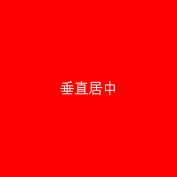

# 第二个
## 导航栏：
    ul{
        list-style-type:none;
    }
    li{
        display:inline;
    }
    a{
        text-decoration:none;
    }
## 表格：
    table{
        border-collapse:collapse;
    }
## 表单：

    table{
        float:left;
        width:35%;
        text-align:right;
    }
# 第四个
## 居中
### 字体(内容)居中

#### table-cell法：
    .center{
        width:250px;
        height:250px;
        background: red;
        *display:table-cell;//相当于tr
        *vertical-align: middle;//使内容垂直居中
        *text-align:center;//使内容水平居中
    }
    
垂直居中

#### display:flex法:
    .center{
        *display:flex;//不可轻易设置
        *justify-content:center;//使内容水平居中，和flex一块用才居中
        *align-items:Center;//使内容垂直居中，同上
    }
### div块居中
#### 绝对定位和负边距法(前提知道宽高)：
    .center{
        *position:absolute;
        *top:50%;
        *left:50%;
        /*margin-left:-100px;
        *margin-top:-50px;/也可改为transform:translate(-50%,-50%)
        width:200px;
        height:100px;
        background:green;
    }
    
垂直居中

#### 绝对定位和0(不用知道宽高):
    .center{
       *position:absolute;
       *top:0;left:0;bottom:0;right:0;
       *margin:auto;//此属性在相对定位中无效
        width:50%;
        height:50%;
        background:green;
    }
# 第八个
## 固定盒子大小
    container{
        box-sizing:border-box;
        //设置他以后，相当于以怪异模式解析，border和padding全会在你设置的宽度内部，比如手机端设置两行并且的布局，宽度各为50%,如果不用这个属性，设置border后右边的div会下来错位，设置这个属性，宽度还是50%而不是50%+*px,两行可以并列显示
    }
## 响应式网格（栅格化）布局
### 不设置宽度具体大小，设置百分比。
    css:
    @media (min-width:769px){
        .col-mi-1{
                width: calc(8.333% - 22px);
        }//这里用col前缀，当宽度大于769时显示
        
    @media (max-width:768px){
        .col-mi-1{
                width: calc(15% - 22px);
        }//这里用col前缀，当宽度小于769时显示
