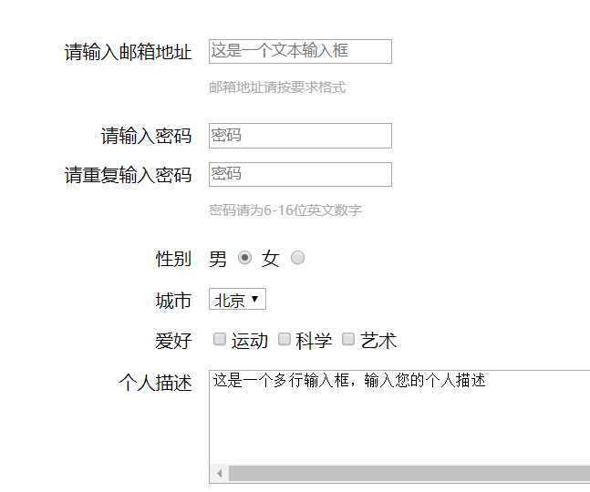
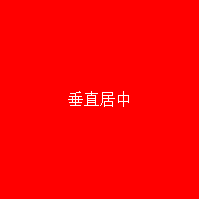
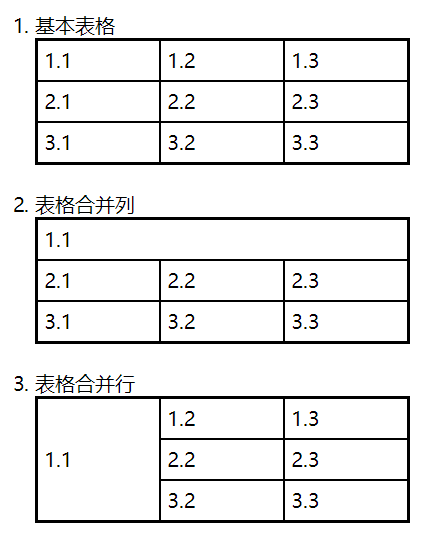
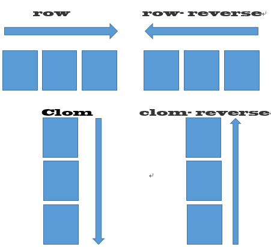
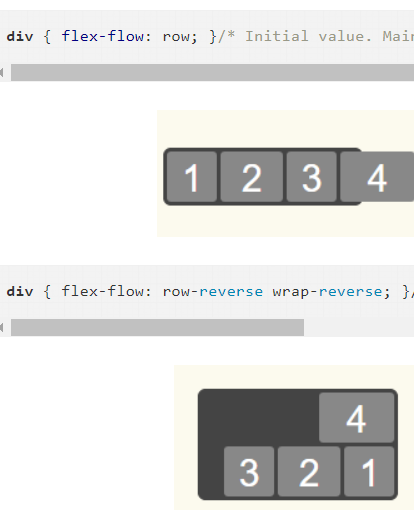
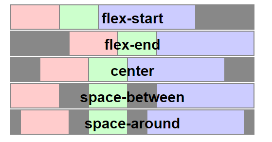
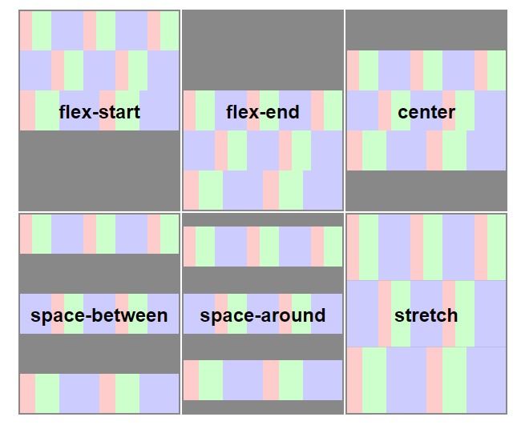
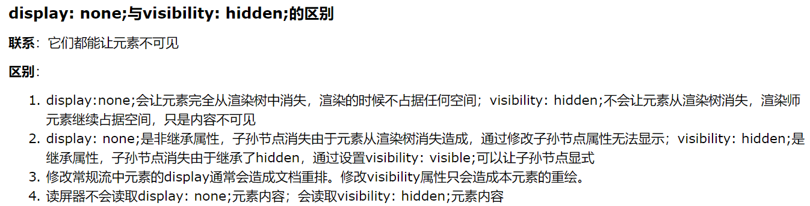
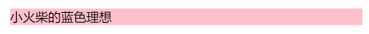

# 第二个
## 导航栏：
    ul{
        list-style-type:none;
    }
    li{
        display:inline;
    }
    a{
        text-decoration:none;
    }
## 表格：
    table{
        border-collapse:collapse;
    }
## 表单：

    table{
        float:left;
        width:35%;
        text-align:right;
    }
# 第四个
## 居中
### 字体(内容)居中

#### table-cell法：此方法需要设置长度，不然就是元素长度
    .center{
        width:250px;
        height:250px;
        background: red;
        *display:table-cell;//相当于tr
        *vertical-align: middle;//使内容垂直居中
        *text-align:center;//使内容水平居中
    }
    
垂直居中

#### table-cell法：此方法需要设置长度，不然就是元素长度(水平居中)
    .center{
        display:table;
        margin:0 auto;
    }    
#### display:flex法:此方法需要知道高才能垂直居中
    .center{
        *display:flex;//不可轻易设置
        *justify-content:center;//使内容水平居中，和flex一块用才居中
        *align-items:Center;//使内容垂直居中，同上
    }
### div块居中
#### 绝对定位和负边距法(前提知道宽高)：
    .center{
        *position:absolute;
        *top:50%;
        *left:50%;
        /*margin-left:-100px;
        *margin-top:-50px;/也可改为transform:translate(-50%,-50%)
        width:200px;
        height:100px;
        background:green;
    }
    
垂直居中

#### 绝对定位和0(不用知道宽高):
    .center{
       *position:absolute;
       *top:0;left:0;bottom:0;right:0;
       *margin:auto;//此属性在相对定位中无效
        width:50%;
        height:50%;
        background:green;
        .time-show:nth-child(2)
    }
# 第八个
## 固定盒子大小
    container{
        box-sizing:border-box;
        //设置他以后，相当于以怪异模式解析，border和padding全会在你设置的宽度内部，比如手机端设置两行并且的布局，宽度各为50%,如果不用这个属性，设置border后右边的div会下来错位，设置这个属性，宽度还是50%而不是50%+*px,两行可以并列显示
    }
## 响应式网格（栅格化）布局
### 不设置宽度具体大小，设置百分比。
    css:
    @media (min-width:769px){
        .col-mi-1{
                width: calc(8.333% - 22px);
        }//这里用col前缀，当宽度大于769时显示
        
    @media (max-width:768px){
        .col-mi-1{
                width: calc(15% - 22px);
        }//这里用col前缀，当宽度小于769时显示
        
# 第九个
## justify-content: space-between：使每个子盒子左右均分在大盒子里面，用此主要免于设置小盒子间边距。
## 表格
    border="2"//合并单元格
    colspan="3"//表格合并列
    rowspan="3"//表格合并行

# 第十个
## flexbox布局
##### flexbox包含父元素flex container和子元素flex items属性
### 6个属性设置在容器上，即flex container：
* flex-direction
* flex-wrap
* flex-flow
* justify-content
* align-items
* align-content
#### 1.display
    display: flex | inline-flex;
#### 2.flex-direction
##### 决定项目的*排列方向*
    .box{
        flex-direction:row;//默认值，主轴在从左向右排列
        flex-direction:row-reverse;//主轴从右向左排列
        flex-direction:column;//主轴从上到下排列
        flex-direction:column-reverse;//主轴从下到上排列
    }

#### 2.flex-wrap
##### 决定如果一行排列不下*如何换行*
    .box{
        flex-wrap:nowrap//默认，撑死不换行
        flex-wrap:wrap//换行，第一行在上方
        flex-wrap:wrap-reverse//换行，第一行在下面
    }

#### 3.flex-flow
##### 此属性是flex-direction属性和flex-wrap属性的*简写*，默认值为row nowrap
    flex-flow: row nowrap//以此类推其他值

#### 4.justify-content
##### 此属性定义项目在主轴上的*对齐方式* 
    .box{
        justify-content:flex-start//默认，左对齐
        justify-content:flex-end//右对齐
        justify-content:center//居中
        justify-content:space-between//两端对齐，项目之间的间隔都相等。
        justify-content:space-around//每个项目两侧的间隔相等。所以，项目之间的间隔比项目与边框的间隔大一倍。
    }

#### 5.align-content
##### 定义/*多根轴线的对齐方式*/。如果项目只有一根轴线，该属性不起作用
    .box {
        align-content:flex-start//与交叉轴起点对齐
        align-content:flex-end//与交叉轴终点对齐
        align-content:center//与交叉轴中点对齐
        align-content:space-between//与交叉轴两端对齐，轴线之间的间隔平均分布
        align-content:space-around//每根轴线两侧的间隔都相等。所以，轴线之间的间隔比轴线与边框的间隔大一倍。
        align-content:stretch//默认，轴线占满整个交叉轴。
    }

#### 6.align-items
##### 定义项目*在交叉轴上如何对齐*
    .box {
    align-items:flex-start//与交叉轴的起点对齐
    align-items:flex-end//与交叉轴的终点对齐
    align-items:center//垂直在中间
    align-items:baseline//项目的第一行文字的基线对齐
    align-items:stretch;//默认，若项目未设置高度或auto，将占满整个容器的高度
    }

### 6个属性设置在项目上，即flex items：
* order
* flex-grow
* flex-shrink
* flex-basis
* flex
* align-self
*flex:1这个属性通常用于导航条，给li设置，使导航内容扩大，以至于点击导航时下划线足够长。不仅省去了设置间距问题，还避免了内容过小使得下划线等不美观*
#### 1.order
##### 定义项目的*排列顺序*。数值越小，排列越靠前，默认为0
    .item{
        order:<integer>;
    }

#### 2.flex-grow
##### 定义项目的*放大比例*，默认为0，即如果存在剩余空间，也不放大。
    .item{
        flex-grow:<number>
    }

#### 3.flex-shrink
##### 定义项目的*缩小比例*，默认为1，即如果空间不足，该项目将缩小。（如果所有项目的flex-shrink属性都为1，当空间不足时，都将等比例缩小。如果一个项目的flex-shrink属性为0，其他项目都为1，则空间不足时，前者不缩小。）
    .item{
        flex-grow:<number>
    }

#### 4.flex-basis
##### 属性定义了在分配多余空间之前，项目占据的主轴空间（main size）。浏览器根据这个属性，计算主轴是否有多余空间。它的默认值为auto，即项目的本来大小。
    .item{
        flex-basis: <length> | auto; 
    }
#### 5.flex
##### 属性是flex-grow, flex-shrink 和 flex-basis的简写，默认值为0 1 auto。后两个属性可选。
    .item{
        flex:none
    }
#### 6.align-self
##### 允许单个项目有与其他项目不一样的对齐方式，可覆盖align-items属性。默认值为auto，表示继承父元素的align-items属性，如果没有父元素，则等同于stretch
    .item{
         align-self: auto | flex-start | flex-end | center | baseline | stretch;
    }

### 响应式图片设置
#### 方法一：
    img{
        max-width:100%;
    }
*面对hover下的下划线被图片盖住问题，添加margin即可*

# 四个自适应宽高
#### [注意]IE浏览器不支持，webkit内核浏览器需添加-webkit-前缀
* fill-available
* max-content
* min-content
* fit-content
### width:-webkit-fill-available
    div{
    background-color: pink;
    display:inline-block;
    width:-webkit-fill-available;
    }
    
小火柴的蓝色理想

    
### 更多：https://www.cnblogs.com/xiaohuochai/p/7210540.html
# 控制鼠标事件:
## 实现禁用鼠标单击，也可用于禁止页面跳转
    pointer-events:none

