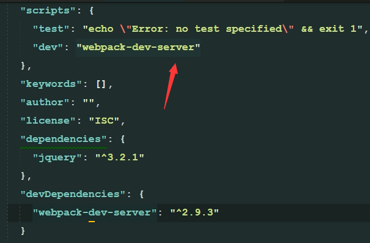
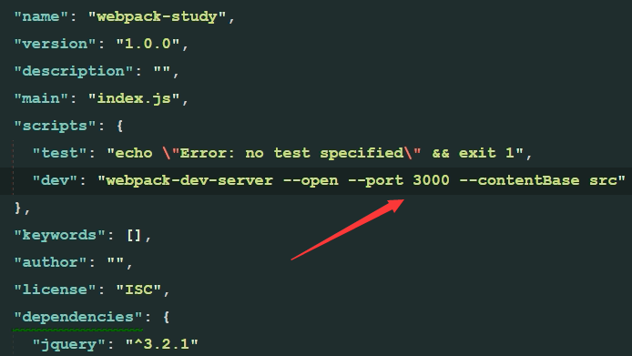
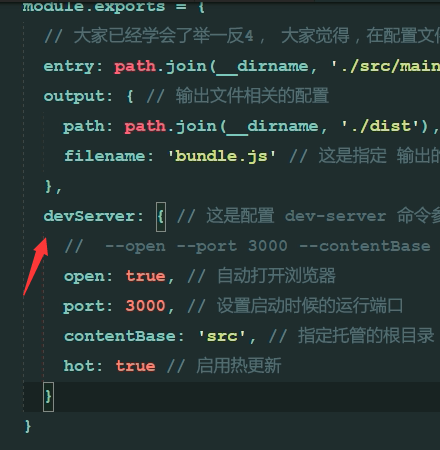
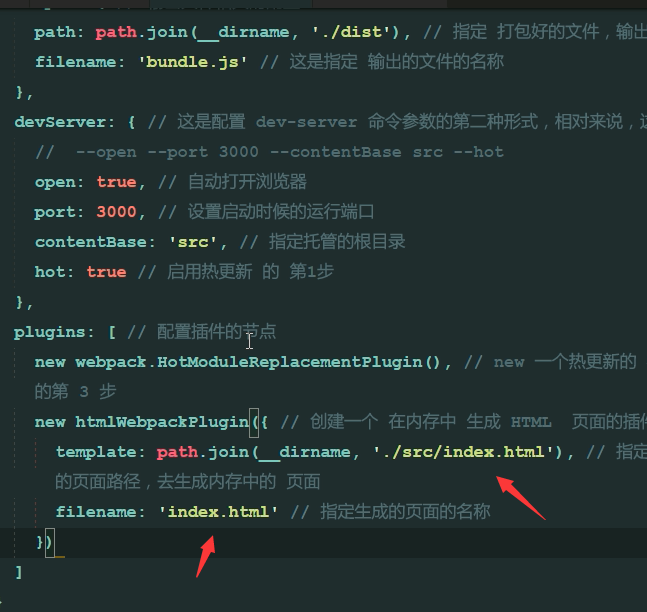
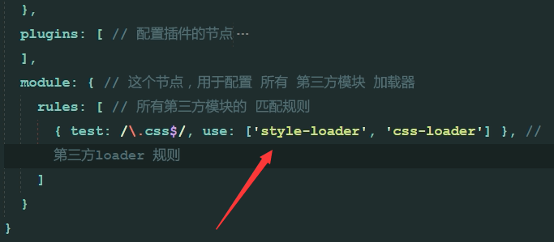
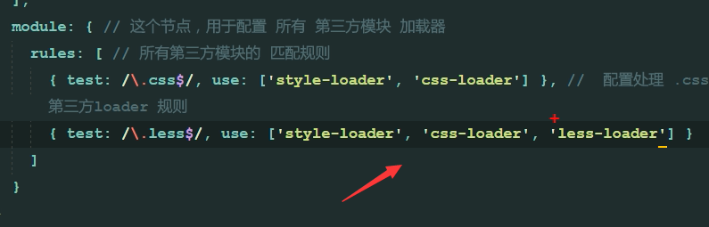
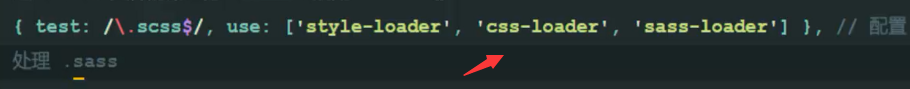

## 1.如果需要jq，首先本项目中打开命令行，输入
    npm i -y
> 此时你会发现你的项目栏多了一个package.json(我自己还发现有(package-lock.json)
## 2.正式安装jq,命令行输入
    npm i jquery -S
> 完成后你会发现项目栏中自动生成了一个node_modules文件夹
## 3.在index.html文件下编辑好内容，在main.js中写好jquery代码，然后在main.js中导入jquery包
> 因为我们已经在项目中安装了jq,所以可以直接在main.js导入代码：

    import $ from 'jquery'
> 之后即使你在index.html中添加链接导入main.js仍然实现不了jq效果，这是因为当前浏览器版本低，不支持import $ from 'jquery',于是引入webpack，此工具可以打包我们的css,js等扩展，使浏览器可以解析他们。
## 4. 创建webpack，将引入外部扩展文件的那个js文件通过webpack放在bundle.js(自己起的名字)里，命令行输入：
    webpack .\src\main.js .\dist\bundle.js

* 完成之后你会发现dist文件夹下生成了一个bundle.js文件。这里的.\src\main.js文件是专门用来导入各个文件包的。这个命令的目的是将main.js处理好并放入dist目录下bundle.js。成功：

### 此时就可以把index.html下引入的main.js删掉了，因为webpack已经帮我们生成了一个bundle.js，此js不仅能解析import包的问题，并且还在index.html下自动为我们导入了这个文件，所以我们不需要再导入任何文件了。（可以看一下在index.html中导入boundle.js
`<script src="../dist/bundle.js">`检查后删掉！！！！！！！！！！！！！！）
## 5.但是如果修改我们的html内容，我们还需要再次使用第4步骤中的命令行，太麻烦，于是在项目根目录新建一个webpack.config.js文件。文件中输入代码：
```
const path = require('path')
module.exports = {  
    entry:path.join(__dirname,'./src/main.js'),
    output:{
        path:path.join(__dirname,'./dist'),
        filename:'boundle.js'
    }
}
```
## 7.命令行输入
    webpack
> 之后再更改html则会自动更改样式，但我们每次更改后都要输入webpack，于是有了方法8
## 8.为了让更改后的样式自动更新，命令行输入
    cnpm i webpack-dev-server -D
## 9.将webpack-dev-server命令安装到本地，方法：在package.json中的scripts对象中输入
    "dev":"webpack-dev-server --open --port 3000 --contentBase src --hot"
## 10.运行更改，在命令行输入
    npm run dev



## 11.安装webpack,在命令行输入
    cnpm i webpack -D
## 12.运行更改，在命令行输入
    npm run dev
> 可发现网页可以自动变换更改了，前提是把你的index.html中引入的script变成`<script src="/bundle.js">`
## 扩展：9方法中的 --open --port 3000 --contentBase src --hot可以写在webpack.config.js里，如图，并在webpack.config,js里添加
    const webpack = require('webpack')


* 麻烦，因此推荐使用方法9
## 13.在内存中生成html,下载插件，命令行输入
    cnpm i html-webpack-plugin -D
## 14.同时在webpack-dev-server中导入插件，代码：
    const htmlWebpackPlugin=require('html-webpack-plugin')
    plugins添加
    new htmlWebpackPlugin({
        template:path.jion(__dirname,'./src/index.html')
    })

* 这之后可以不再在index.html中引用bundle.js了
## 15.引入css文件。在css文件夹建立index.css文件，然后在main.js导入样式表
    import './css/index.css'
## 16.命令行输入
    cnpm i style-loader css-loader -D
## 17.同时打开webpack.config.js,添加代码：

* 启用npm run dev
## 18.引入less文件。在css文件夹建立index.less文件，然后在main.js导入样式表
    import './css/index.less'
## 19.命令行输入
    cnpm i less-loader -D
    之后输入
    cnpm i less -D
## 20.同时打开webpack.config.js,添加代码：

* 启用npm run dev
## 21.引入less文件。在css文件夹建立index.scss文件，然后在main.js导入样式表
    import './css/index.scss'
## 22.命令行输入
    cnpm i sass-loader -D
    之后输入
    cnpm i node-sass -D
## 23.同时打开webpack.config.js,添加代码：

* 启用npm run dev

