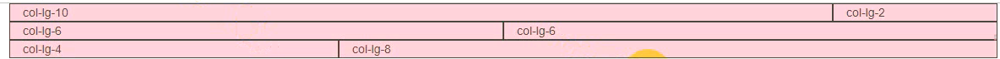
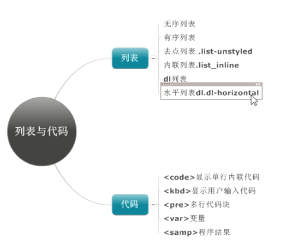
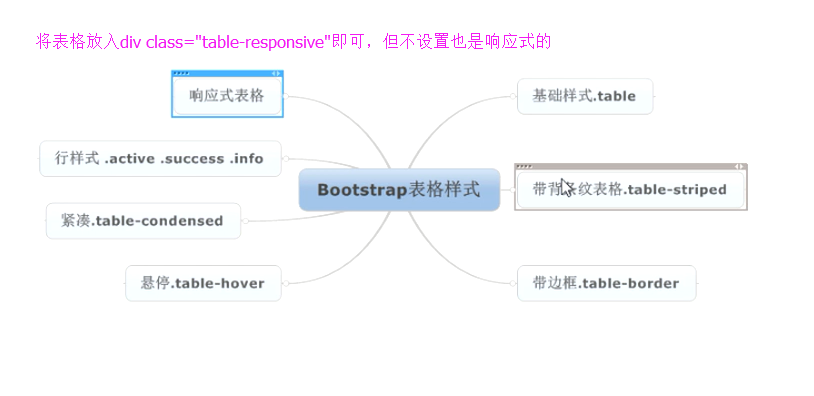
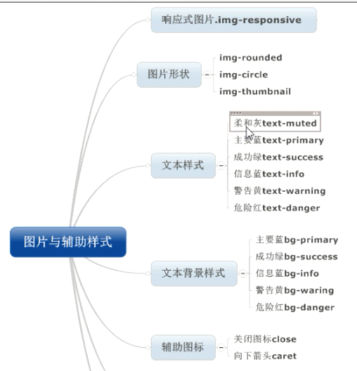
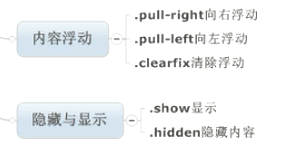

## 容器
>流体容器
>固定容器
* 媒体查询>=1200(@screen-sm-min)    width:1170
* 媒体查询>=992(@screen-md-min)     width:970
* 媒体查询>=768(@screen-lg-min)     width:750
* 媒体查询<768(@screen-xs-min)      width:auto
## 栅格系统

* 默认是12个格子
```html
<div>
  <div class="col-lg-10">10格子</div>
  <div class="col-lg-2">2格子</div>
</div>
```
* 偏移格子`col-lg-offset-3`
## 列表与代码

## 表格

## 图片辅助样式

## 浮动与隐藏，显示
