# 面向对象编程思想
#### 根据需求，分析对象，找到对象有什么特征和行为，通过代码的方式来实现需求，要想实现这个需求，就要创建对象，要想创建对象，就应该先有构造函数，然后通过构造函数来创建对象，通过对象调用属性和方法来实现相应的功能及需求
#### 首先JS不是一门面向对象语言，JS是一门基于对象的语言，为何学习JS还要了解面对对象？因为面对对象的思想适合于人的想法，编程起来更方便，更有利于后期维护
#### 面向对象语言有类（class）的概念（也是一种特殊的数据类型）,但是js不是面向对象的语言，所以js中没有类（class），但是JS可以模仿面向对象的编程思想，js中会通过构造函数来模拟类的概念(class)
## 面向对象的特征：封装，继承，多态![]
### 封装：就是包装。
* 一个值存储在一个变量中--封装
* 一坨重复代码放在一个函数中--封装
* 一系列的属性放在一个对象中--封装
* 一些功能类似的函数（方法）放在一个对象中--封装
* 好多相类似的对象放在一个js文件中---封装
### 继承：首先继承是一种关系，子类继承父类，类（class）与类之间的关系，js中没有类，但是可以通过构造函数模拟类，然后通过原型来实现继承
* 继承也是为了数据共享，js中的继承也是为了实现数据共享
> 继承方法：
* 原型实现继承，缺陷：因为改变原型指向的同时实现继承，直接初始化了属性，继承过来的属性的值都是一样的了
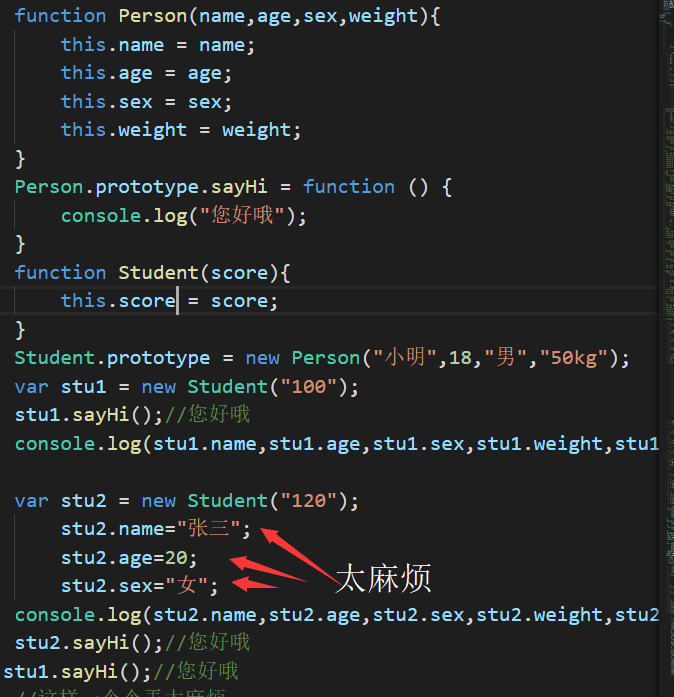
* 借用构造函数实现继承（构造函数.call(当前对象（通常写this）,属性，属性，属性...)）。缺陷：不能继承原型方法。
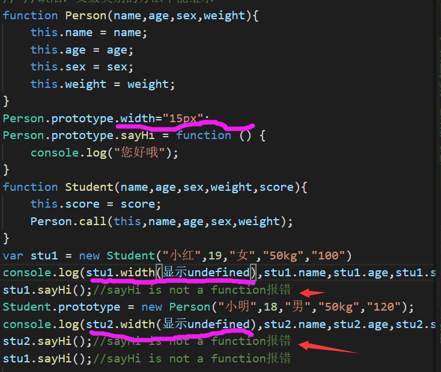
* 组合继承：原型继承+借用构造函数继承。优点：属性值不一样且继承了原型方法
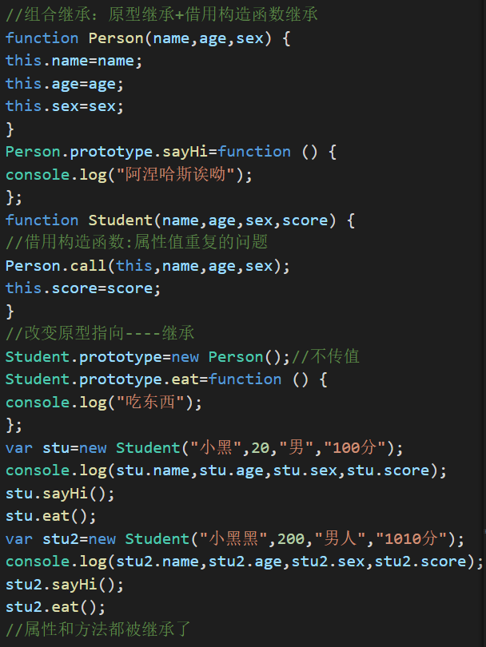
* 拷贝继承:缺点：效率较低，内存占用高（因为要拷贝父类的属性）；无法获取父类不可枚举的方法（不可枚举方法，不能使用for in 访问到）
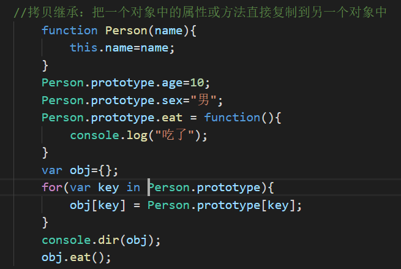
### 原型作用之一：数据共享，节省内存空间
### 原型作用之二：为了实现继承
### 多态：一个对象有不同的行为，或者是同一个行为针对不同的对象，产生不同的结果，要想有多态，就先有继承。
# js书写位置
## 如果js写在html前面，则
    js:
    window.onload = function(){
    }
## console.dir()查看元素结构
# window事件
## setInterval计时器
### setInterval采用间歇调用。他会按照指定的时间重复执行代码。清除用clearInterval(timer)
    语法：timer=setInterval(function(){
            函数体
    },500)。
    或者：setInterval(函数名不加括号,时间)
    或者匿名函数：setInterval(function(){},时间)
### setTimeOut采用超时调用，即只能执行一次，相当于一个延时函数。要等函数内东西执行完才能在执行.清除把set改成clear
# DOM事件
## document.getElementById("")和document.getElementsByName("")返回值是对象，其他的返回的是指定类名的元素集合，作为nodeList对象，NodeList 对象代表一个有顺序的节点列表。NodeList 对象 我们可通过节点列表中的节点索引号来访问列表中的节点。而且他的顺序是看html从上到下该类集合的顺序。
## x.addEventListener("mouseout",myFunction)和<标签onchange="myFunction()">的区别在于一个离开鼠标一个原数发生改变时触发
## window.event.srcElement和window.event.target
### 都是指向事件触发的元素，第一个只能用在ie浏览器，第二个火狐，所以一般写成：object = event.srcElement || event.targe
## 元素.classList.add添加元素style,元素.classList.remove移除元素属性
## dom实际上是一个对象，所以可以通过打点调用的方法来获取元素的值。
    <div class="box" id="box" src="jjjjjjj"></div>
        obox=document.getElementById("box");
        console.log(obox.id)//box
        console.log(obox.src)//jjjjjjj
## 既然可以打点调用同样也可以直接更改元素值，但id不可以改动值，自定义属性不能使用点语法因此不能改变值也不能查看值。
    <div class="box" id="box" hua="huanghua"></div>
        obox=document.getElementById("box");
        console.log(obox.huanghua)//报错
        obox.id = "xbox"//不报错但无法使用
        obox.src = "kkkkk"//一切按预期发展
## 那该如何查看和改变自定义属性的值呢
    <div class="box" id="box" hua="huanghua"></div>
    box.getAttribute("hua")//读取hua的内容
    box.setAttribute("hua","baicai")将huanghua变成baicai
## 点操作语法
1. 点语法操作属性时，属性名可能需要更改。而getAttribute()和setAttribute()不需要
* class->className
* for->htmlFor![]
* colspan->colSpan
* rowSpan->rowSpan

    例如：console.log(box.className)
    console.log(box.getAttribute("class"))

2. 点语法操作对象时得到的是对象，而getAttribute()和setAttribute()得到的是字符串

    例如：console.log(typeof box.style)//object
    console.log(typeof box.getAttribute("style"))//string

## 打点调用-查看元素样式即style
## 内嵌样式可直接test(名字).style.backgroundColor,内部样式在除ie之外采用window.getComputedStyle(test).width或者window.getComputedStyle(test)['background-color']。内部样式在ie下采用test.currentStyle.width
    #test{
        width:500px;
        height:300px;
        background-color:#CCC;
        float:left;
    }
    <div id = "test"></div>
    <div id = "tag" style = "width:500px; height:300px;background-color:pink;"></div>
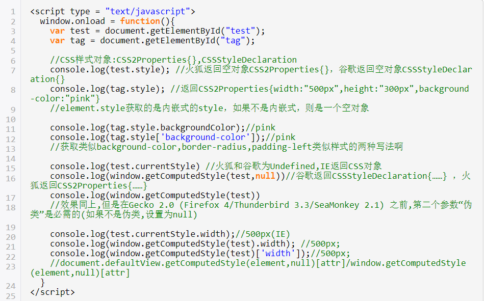
# 判断某元素是否有指定class名的几种方法：
## 在不考虑兼容ie10的情况下用classList
    var node = document.getElementById('demo');
    if(node.classList.contains('text')){
        console.log("包含text这个class")
    }
## 兼容方法采用className和getAttribute('class')
    if(node.getAttribute('class'))//存在class属性{
        //方式一
        if(node.getAttribute('class').indexOf('test')>-1){
           console.log("包含text这个class") 
        }
        //方式二
        if(node.className.indexOf('text')>-1){
            console.log("包含text这个class")
        }
# js数据类型
* 布尔boolean
* 数组Array
* 字符串String
* 数字number
* 对象object
* 空null
* 未定义undefined
# 字符串String
字符串用双引号或者单引号包含，若内部还有符号，在符号前加\
## 创建字符串
    var txt = new String("string");
    或者var tex = "string"
## 字符串可以是对象
    var x="kk"
    var y=new String("kk")；
    typeof x//返回string
    typeof y//返回object
    document.getElementById("demo").innerHTML = x===y;//返回false，因为一个是字符串一个是对象,===为绝对相等
## 字符串对象属性
* constructor 对创建该对象的函数的引用
* length 字符串长度
* prototype 给字符串添加属性
## 字符串对象方法:
## charAt()
### charAt(index)返回在指定位置上的字符。语法：string.charAt(index)
## charCodeAt()
### charCodeAt()返回指定位置上的Unicode编码。语法：string.charCodeAt(index)
## fromCharCode()
### fromCharCode()接受一个Unicode值，返回对应的字符。语法：string.fromCharCode(n1,n2,n3....,nx)
## concat()
### concat()连接两个或更多的字符串，返回新的字符串。语法：string.concat(string1, string2, ..., stringX)
## indexOf()
### indexOf()返回某个字符串值在字符串中首次出现的位置。语法：string.indexOf(searchvalue必须,start起始搜索位置非必需)，不存在返回-1
## lastIndexOf()
### lastIndexOf()从后向前检索字符串，即查找最后出现的位置，语法和indexOf一样
## match()
### match()用于查找到一个或多个正则表达式,返回指定的值
## search()
### search()用于检索字符串中指定的字符第一次出现的位置,或查找正则
## replace()
### replace()用于查找字符串中正则表达式或其他内容并替换。语法：string.replace(searchvalue,newvalue)
## slice()
### slice()提取字符串片段，并返回被提取的部分.语法：string.slice(start,end(不包含)).start=-1时，代表从尾部开始
    var str = "Hello world"
    var n = str.slice(1,5);
    console,log(n)//ello 
## substr()
### substr()在字符串抽取字符串，不改变原字符串，语法string.substr(start,length).length与slice的区别即在这里。IE对substr接收负值的处理有错，它会返回原始字符串。
    var str = "hello world"
    var n = str.substr(2,3)//llo
## split()
### split()把字符串分割成字符串数组,即遇见括号的就变成逗号。语法：string.split(separator,limit(数组的最大长度))
    var str = "How are you"
    var n = str.split(" ");
    console.log(n)//how,are,you
## substring()
### substring()和slice用法一样，区别在于当为负数时，slice代表从后面算-1，-2，而substring则统一认为从0算。而且substring是以两个参数中较小一个作为起始位置，较大的参数作为结束位置。
## toUpperCase
## toUpperCase()把字符串全部转换成大写
    var s='hello'
    s.toUpperCase();//返回HELLO
## toLowerCase
## toLowerCase()把字符串全部转换成小写
    var s='Hello'
    s.toLowerCase();//返回hellow
## parseInt()
### ES6 引入了字符串补全长度的功能，如果某个字符串不够指定长度，会在头部活尾部补全。
#### padStart(第一个参数规定字符串长度，第二个人参数指定填充的内容) 用于头部补全；
#### padEnd() 用于尾部补全。
#### 具体用法：(https://blog.csdn.net/ww430430/article/details/78363026).通常用于日期
## 将字符串变成数字
    a="123";b="456"
    x=parseInt(a)+parseInt(b)//x=579
## ie6新方法padStart()

## strig HTML包装方法
## anchor()
### anchor()用于创建html.语法：string.anchor(name)
    var txt = "jkl";
    txt.anchor("ha");
    alert(txt.anchor("ha"))//<a name="ha">jkl</a>
* big() 用大号字体显示字符串
* small() 用小号字体显示字符串
* blink() 不能用于IE,Chrome,或者Safari
* blod() 加粗字符串
* fixed() 用打印机文本显示字符串
* fontcolor("blue") 使用指定颜色显示字符串
* strike() 加删除线
* fontsize("12") 使用制定字体大小
* sub() 上浮字符串
* sup() 下浮字符串
* link("链接") 添加链接
* italics() 斜体字
# 数组
## 已知其他数组创建新数组
    var arr = [];
        for(i=0; i<len; i++){
            arr.push(parseInt(list[i].innerText));//parseInt表示转换成整行
        }
## indexOf
### 通过indexOf()来搜索数组中一个指定的元素的位置
    var arr = [10, 20, '30', 'xyz'];
    arr.indexOf(10); // 元素10的索引为0
    arr.indexOf(20); // 元素20的索引为1
    arr.indexOf(30); // 元素30没有找到，返回-1
    arr.indexOf('30'); // 元素'30'的索引为2
### 如果不给slice()传递任何参数，它就会从头到尾截取所有元素。利用这一点，我们可以很容易地复制一个Array：
    var arr = ['A', 'B', 'C', 'D', 'E', 'F', 'G'];
    var aCopy = arr.slice();
    aCopy; // ['A', 'B', 'C', 'D', 'E', 'F', 'G']
    aCopy === arr; // false
## push,pop
### push()向Array的末尾添加若干元素，pop()则把Array的最后一个元素删除掉.语法：array.pop().返回数组的最后一个元素。arrayObject.push(newelement1,newelement2,....,newelementX)，返回新的长度
    var arr = [1, 2];
    arr.push('A', 'B'); // 返回Array新的长度: 4
    arr; // [1, 2, 'A', 'B']
    arr.pop(); // pop()返回'B'
    arr; // [1, 2, 'A']
    arr.pop(); arr.pop(); arr.pop(); // 连续pop 3次
    arr; // []
    arr.pop(); // 空数组继续pop不会报错，而是返回undefined
    arr; // []
## unshift,shift
### 如果要往Array的头部添加若干元素，使用unshift()方法，shift()方法则把Array的第一个元素删掉,和pop,push相反
    var arr[1,2];
    arr.unshift('A','B');// 返回Array新的长度: 4
    arr; // ['A', 'B', 1, 2]
    arr.shift(); // 'A'
    arr; // ['B', 1, 2]
    arr.shift(); arr.shift(); arr.shift(); // 连续shift 3次
    arr; // []
    arr.shift(); // 空数组继续shift不会报错，而是返回undefined
    arr; // []
## sort
### sort()可以对当前Array进行排序，它会直接修改当前Array的元素位置，直接调用时，按照默认顺序排序
    var arr = ['B', 'C', 'A'];
    arr.sort();
    arr; // ['A', 'B', 'C']
    //sort排序不稳定，解决方法：
    var arr=[100,1,50,26,89,100,108];
    arr.sort(function (x,y){
        if(x>y){
            return 1;//相当于x-y>0
        }else if(x==y){
            return 0;
        }else{
            return -1
        }
    });
    console.log(arr)//按从小到大顺序排列
### 在二维数组中应用举例:将比较90，50等的值，并按递减顺序排列，若改成x-y则按递增顺序排列
    var aqiData = [
    ["北京", 90],
    ["上海", 50],
    ["福州", 10],
    ["广州", 50],
    ["成都", 70],
    ["西安", 100]
    ];
    aqiData.sort(function(x,y){
        return y[1]-x[1];
    })
## reverse
### reverse()把整个Array的元素掉个，即反转
    var arr=['one','two','three'];
    arr.reverse();
    arr;//['three','two','one'];
## slice
### 截取Array(数组)的部分元素，然后返回一个新的Array，注意不改变原数组
    var arr = ['A', 'B', 'C', 'D', 'E', 'F', 'G'];
    arr.slice(0, 3); // 从索引0开始，到索引3结束，但不包括索引3: ['A', 'B', 'C']
    arr.slice(3); // 从索引3开始到结束: ['D', 'E', 'F', 'G']
## splice
### splice()是修改数组的万能方法，它可以从指定的索引开始删除若干元素，然后再从该元素位置添加若干元素
    var arr=['Microsoft', 'Apple', 'Yahoo', 'AOL', 'Excite', 'Oracle'];
    // 从索引2开始删除3个元素,然后再添加两个元素:
    arr.splice(2, 3, 'Google', 'Facebook');
    arr; // ['Microsoft', 'Apple', 'Google', 'Facebook', 'Oracle']
    // 只删除,不添加:
    arr.splice(2, 2); // ['Google', 'Facebook']
    arr; // ['Microsoft', 'Apple', 'Oracle']
    // 只添加,不删除:
    arr.splice(2, 0, 'Google', 'Facebook'); // 返回[],因为没有删除任何元素
    arr; // ['Microsoft', 'Apple', 'Google', 'Facebook', 'Oracle']
## findIndex()
### findIndex() 方法返回传入一个测试条件（函数）符合条件的数组第一个元素位置。findIndex() 方法为数组中的每个元素都调用一次函数执行：当数组中的元素在测试条件时返回 true 时, findIndex() 返回符合条件的元素的索引位置，之后的值不会再调用执行函数。
如果没有符合条件的元素返回 -1
## every()
### every()方法检测数组的所有元素是否符合指定条件,返回false/true
## concat
### concat()方法把当前的Array和另一个Array连接起来，并返回一个新的Array
    var arr = ['A', 'B', 'C'];
    var added = arr.concat([1, 2, 3]);
    added; // ['A', 'B', 'C', 1, 2, 3]
    arr; // ['A', 'B', 'C']
    请注意，concat()方法并没有修改当前Array，而是返回了一个新的Array。
### 语法：array1.concat(array2,array3,...,arrayX)，也可以是其他数据类型的参数
### 实际上，concat()方法可以接收任意个元素和Array，并且自动把Array拆开，然后全部添加到新的Array里
    var arr = ['A', 'B', 'C'];
    arr.concat(1, 2, [3, 4]); // ['A', 'B', 'C', 1, 2, 3, 4]
## copyWithin()
### copyWithin()方法复制数组中的元素到指定位置。
### 语法：array.copyWithin(target（必须，复制到指定位置）, start（非必须，复制起点）, end)
    var fruits = ["Banana", "Orange", "Apple", "Mango", "Kiwi", "Papaya"];
    fruits.copyWithin(2, 0, 2);//Banana,Orange,Banana,Orange,Kiwi,Papaya
## join
### join()方法是一个非常实用的方法，它把当前Array的每个元素都用指定的字符串连接起来，然后返回连接后的字符串：
    var arr = ['A', 'B', 'C', 1, 2, 3];
    arr.join('-'); // 'A-B-C-1-2-3'
### 如果Array的元素不是字符串，将自动转换为字符串后再连接。
## entries
### entries()方法返回数组的迭代对象，语法array.entries()
    var fruits = ["Banana", "Orange", "Apple", "Mango"];
    fruits.entries();//[0, "Banana"][1, "Orange"][2, "Apple"][3, "Mango"]
## filter
### filter()用于过滤数组中的某些元素并返回剩下的元素
    var arr = ['A', '', 'B', null, undefined, 'C', '  '];
    var r = arr.filter(function (s) {
        return s && s.trim(); //IE9以下的版本没有trim()方法，trim()去掉字符序列左边和右边的空格
    });
    arr; // ['A', 'B', 'C']
## find，findIndex
### find()用于过滤数组中的某些元素并返回剩下的元素的第一个元素.方法返回传入一个测试条件（函数）符合条件的数组第一个元素位置。如果没有，返回-1.语法：array.forEach(function(currentValue, index, arr), thisValue)
## map
### map()方法返回一个新数组，数组中的元素为原始数组调用函数后的值。语法：array.map(function(currentValue,index,arr), thisValue)
## forEach
### forEach()让数组中的每一项做一件事。语法：array.forEach(function(currentValue, index, arr【最多三个参数】), thisValue（可省，省了代表this==undefined）)。ie中没有此方法
## prototype
### prototype方法用于给数组添加属性，也可给对象添加属性，给数组添加时，创建函数:Array.prototype.函数名=function(){}。Array是为了其他数组直接调用
# 对象object
* window是对象
* document是属性,document也是一个对象
* write()是方法
* window.document.write("哈哈");
* 对象.style.color=值;
## 创建对象的四种方法
##### instanceof判断元素类型
1. 字面量的方式
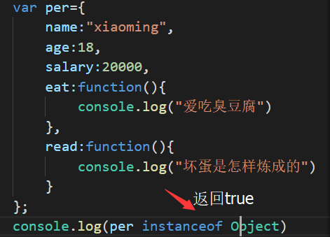
2. 调用系统的构造函数
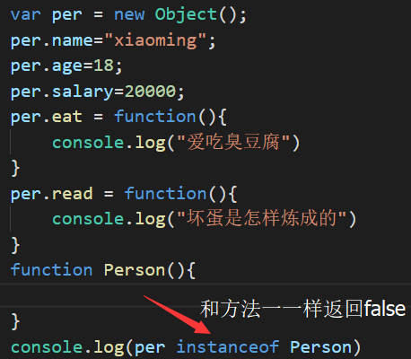
3. 自定义构造函数
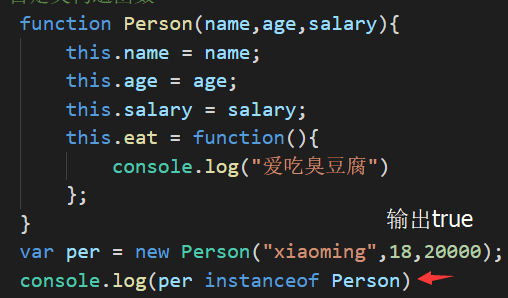
4. 工厂模式创建对象
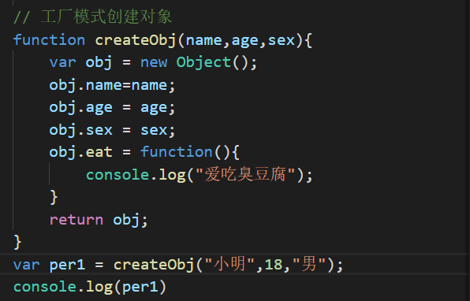
#### 第三种与第四种相同点与不同点：
> 相同点
* 都是函数，都可传入参数，都可以创建对象
> 不同点
* 自定义模式函数首字母名要大写，工厂不需要
* 自定义模式没有new,工厂有
* 自定义函数没有返回值，工厂有
* 自定义中，this是当前的对象；工厂中new之后的对象是当前的对象
* 自定义中，通过new的方式来创建对象；工厂模式则直接调用函数就可创建对象
#### 第三种相较于前两种的优点在于可以很轻松的知道类型，如第三种的person类型.
## 实例对象和构造函数之间的关系
1. 实例对象是通过构造函数来创建的---创建的过程叫做实例化对象
2. 如何判断对象是不是这个数据类型 
* 通过构造器的方式 ：实例对象.构造器==构造函数的名字
* 对象 instanceof 构造函数名字（最佳方法）
## 两种访问对象属性的方式：
* person.lastName;
* person["lastName"]
## 对象方法可定义函数：
    var person={
        name:"kk",
        fullName : function() 
	    {
            return this.firstName + " " + this.lastName;
        }
    }
    person.fullName();//调用，注意括号
## prototype
### prototype给对象添加属性和方法，为了解决数据共享，节省内存空间，语法：object.prototype.name=value
> 创建原型对象的方法:
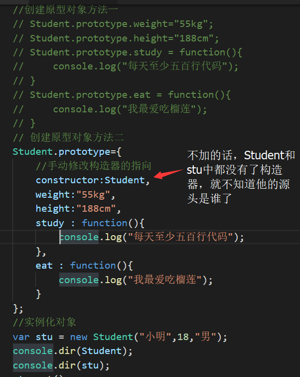

> 什么样子的数据是需要写在原型中?
* 需要共享的数据就可以写原型中
    * 原型的作用之一:数据共享
* 属性需要共享,方法也需要共享
* 不需要共享的数据写在构造函数中,需要共享的数据写在原型中
> 解决数据共享例子：
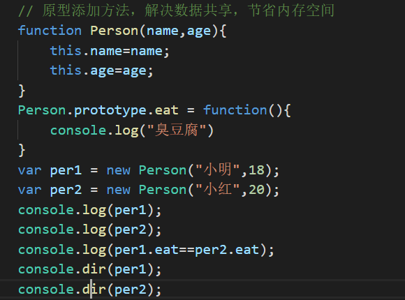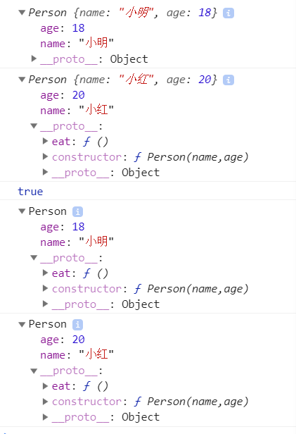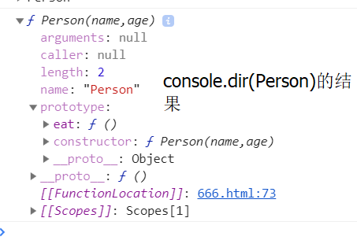
* 实例对象中有__proto__这个属性,叫原型,也是一个对象,这个属性是给浏览器使用,不是标准的属性----->__proto__----->可以叫原型对象
* 构造函数中有prototype这个属性,叫原型,也是一个对象,这个属性是给程序员使用,是标准的属性------>prototype--->可以叫原型对象
* 实例对象的__proto__和构造函数中的prototype相等--->true
* 又因为实例对象是通过构造函数来创建的,构造函数中有原型对象prototype
* 实例对象的__proto__指向了构造函数的原型对象prototype
* 构造函数中不存在name,age这两个属性
* 实例对象中有两个属性(这两个属性是通过构造函数来获取的)
* 实例对象中有个属性,__proto__,也是对象,叫原型,不是标准的属性,浏览器使用的，ie8不支持他是属性
* 构造函数中有一个属性,prototype,也是对象,叫原型,是标准属性,程序员使用
* 原型---->__proto__或者是prototype,都是原型对象,
* 原型的作用:共享数据,节省内存空间
> 总结实例对象，构造函数，原型对象三者间的关系
* 构造函数可以实例化对象
* 构造函数中有一个属性叫prototype,是构造函数的原型对象
* 构造函数的原型对象(prototype)中有一个constructor构造器,这个构造器指向的就是自己所在的原型对象所在的构造函数
* 实例对象的原型对象(__proto__)指向的是该构造函数的原型对象
* 构造函数的原型对象(prototype)中的方法是可以被实例对象直接访问的
> 原型中的方法是可以相互访问的：
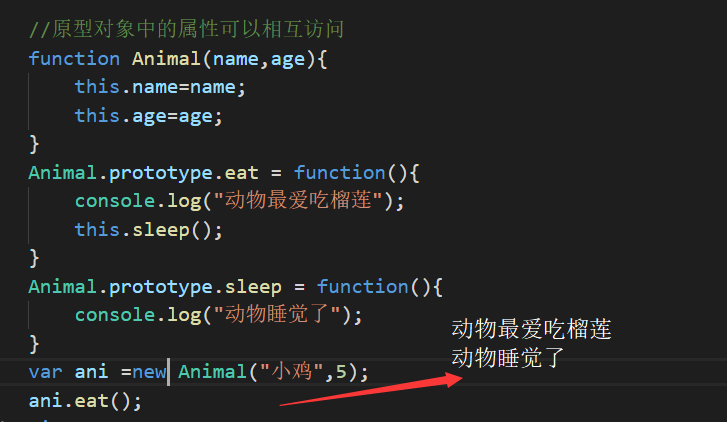
> 原型链
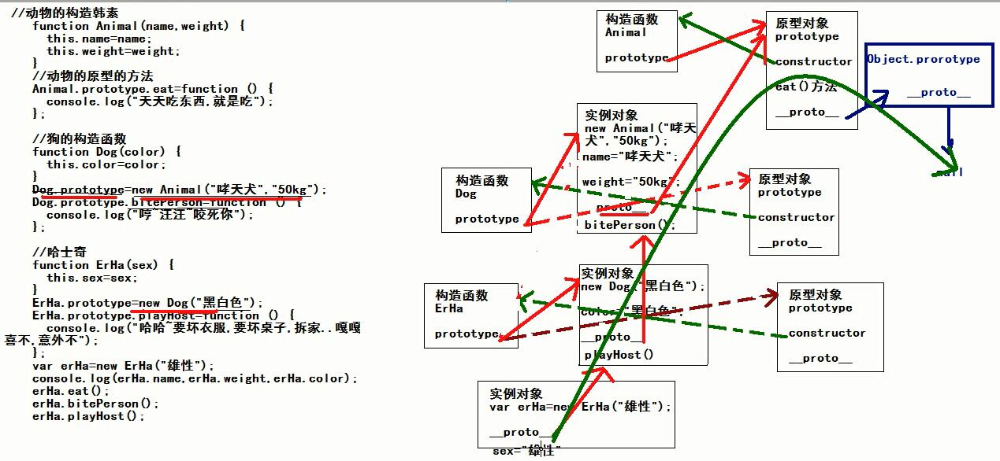
## 对象的复制
#### 对象复制传递的实际是一个对象的引用（可以理解为指针），b继承的是指针，而不是a的值，所以a和b代表的是一个东西
    var a=new Object();
    a.value = 1;
    b = a;
    b.value = 2;
    a.value=3;
    console.log(b.value)
    console.log(a.value)//a=2
# 函数：
## 声明函数
### 方法一,函数的声明
    function myname(变量1，变量2){//或者不定义变量
        代码
    }
    //代码：
    if(true){
        function f1(){
            console.log("哈哈");
        }
    }else{
        function f1(){
            console.log("嘻嘻");
        }
    }
    //if...else语句在ie8下输出“嘻嘻”，在其他输出“哈哈”，但是用函数表达式就不会出现这种问题，所以尽量用函数表达式来写代码
### 方法二，参数作为函数。：函数表达式
    var x=function(变量1，变量2){
        代码
    }
## 函数可以存在于变量后 ，变量可作为函数使用：
     var x=function(a,b){
        return a*b;
    }
    document.getElementById("demo").innerHTML=x(2,3);
## 在表达式的后面紧跟()将自调用函数。给函数添加括号来说明他是一个函数表达式。如：
    (function(){
        var x="hellow";
    })();
## arguments类数组对象，即在他眼里形参和实参就是数组
### arguments.length属性返回调用过程接收到的参数个数,arguments.callee, 引用当前正在执行的函数。
### arguments[i],获取数组中第i个值
## 函数名.toString方法将函数作为一个字符串返回
## 函数的调用方法：
* 作为一个函数调用（不是一个好方法，全局容易造成命名冲突）：
    function myFunction(a,b){
        return a*b;
    }
    myFunction(2,3);//此时默认为全局对象，相当于wendow.myFunction(2,3)。
* 使用构造函数调用函数----通过new 来调用
    //构造函数
    function myFunction(arg1, arg2) {
        this.firstName = arg1;
        this.lastName  = arg2;
    } 
    // 创造一个新的对象
    var x = new myFunction("John","Doe");
    x.firstName;   
* 作为一个方法调用：
    var myObject = {
        firstName:"John",
        lastName: "Doe",
        fullName: function () {
            return this.firstName + " " + this.lastName;
        }
    }
    myObject.fullName();         // 返回 "John Doe"
* 作为函数方法调用函数：
    （1）function myFunction(a, b) {
        return a * b;
    }
    myObject = myFunction.call(myObject, 10, 2);     // 返回 20
    （2）function myFunction(a, b) {
        return a * b;
    }
    myArray = [10, 2];
    myObject = myFunction.apply(myObject, myArray);  // 返回 20
> 全局对象（调用this）。函数中this的指向：
* 普通函数的this是谁？-------window
* 对象.方法中的this是谁？------当前的实例对象
* 定时器方法中的this是谁？-----window
* 构造函数中的this是谁？------实例对象
* 原型对象中的this是谁？------实例对象
* BOM：中顶级对象是window，浏览器中所有的东西都是window的
### 函数是对象，对象不一定是函数；对象中有__proto__，函数中有prototype,如果一个东西里面既有prototype又有__proto__,说明是函数，也是对象
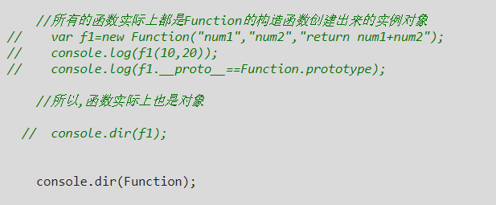
## 函数的几个成员
    函数中有一个name属性----->函数的名字,name属性是只读的,不能修改
    函数中有一个arguments属性--->实参的个数
    函数中有一个length属性---->函数定义的时候形参的个数
    函数中有一个caller属性---->调用(f1函数在f2函数中调用的,所以,此时调用者就是f2)
# 高阶函数之函数作为参数
    function f1(fn){
        console.log("f1的函数");
        fn();//此时fn当作是函数使用了
    }
    //传入匿名函数
    f1(function(){
        console.log("我是匿名函数");//此时输出f1的函数,我是匿名函数
    });
    //命名函数
    function f2(){
        console.log("f2的函数");
    }
    f1(f2);//此时输出f1的函数,我是匿名函数，f1的函数，f2的函数
    //函数作为参数时，如果是命名函数，那么只用传入命名函数的名称，没有括号
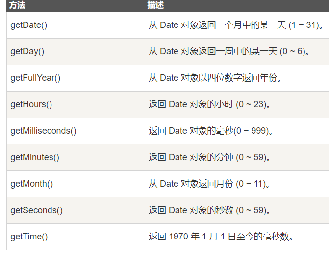
# boolean布尔
## 创建Boolean
    var a = new Boolean(value);由布尔对象存放的值或者要转换成布尔值的值
## boolean对象属性：constructor
### constructor返回对创建此对象的boolean函数的引用
    var text = new Boolean();
    if(text.constructor==Boolean){
        alert("...");
    }
    if(text.constructor==Array){
        alert(">>>");
    }
## boolean对象方法 ：valueOf
### valueOf()方法返回boolean对象的原始值，即true,false。语法：booleanObject.valueOf()
# Data
## Data对象方法：parse()
### parse()返回1970.1.1-某年月日毫秒数.语法：var d = Date.parse("March 21, 2012");
## setData
### setData()方法设置一个月的某一天。语法：Date.setData(day)
# Math对象
## Math对象用于执行数学算法,不存在创建对象
    txt.value =  Math.ceil((Math.random()*99)+1);//匹配1-100
### Math.random()匹配0（包含）-1（不包含）
# Number
## 创建number方法：
    var num = new Number(value)
## Number对象方法:
* toPrecision(x),把数字格式化为指定长度，即保留几位数字
* toFixed(x),把数字转换成字符串，返回小数点后x位数的数字
* toString(),把数字转换成字符串
* valueOf(),返回number的数字
# 正则表达式
* 正则运算式.test(所检测的字符内容)。返回true/false
* match 方法:使用正则表达式模式对字符串执行查找，并将包含查找的结果作为数组返回。
* 正则运算式.replace()匹配字符串
    "123*456".replace(/(\d{3})\*\(d{3})/,"$1""$2") //456*123
    "123*456".replace(/(\d{3})\*\(d{3})/,function(match,$1,$2){
        return $2+"*"+$1;//456*123
    })
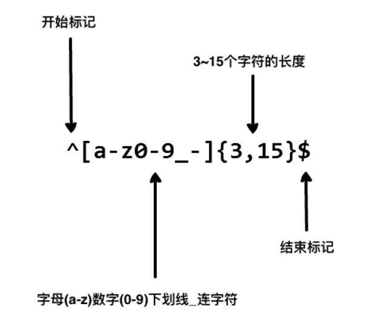
## 手机号验证:
    reg=/^1[345678]\d{9}$/，d表示数字,^表示开始$表示结束
## 匹配中文：[\u4e00-\u9fa5],固定用法，一个中文哦
## 正则量词
### 范围用[],几次用{},至少有几个用{最少,最多},表示只能出现0次或1次用？,至少出现一次用+，表示至少出现0次用*。
    /ab[a-z]b{3}/相当于/ab[a-z]bbb/
    /ab{3,}/.test("abbbbbbbbbbb")//true,至少有三个b
    /(bye){2}/.test("byebye")//true,分组知识点，()代表分组
# ul li运用
## 若在li里添加内容，不使用innerHTML,不然循环只会产生一个，
    beforebegin//作为前一个同辈元素插入
    afterbegin//作为第一个子元素插入
    beforeend//作为最后一个子元素插入，即往后插入
    afterend//作为后一个同辈元素插入
    a.insertAdjacentHTML("beforeend","<li>第"+b[i]+"名:"+aqiData[i][0]+","+aqiData[i][1]+"</li>");
## 获取li元素的值
    <ul id="source">
    <li>北京空气质量：<b>90</b></li>
    <li>上海空气质量：<b>70</b></li>
    <li>天津空气质量：<b>80</b></li>
    <li>广州空气质量：<b>50</b></li>
    <li>深圳空气质量：<b>40</b></li>
    <li>福州空气质量：<b>32</b></li>
    <li>成都空气质量：<b>90</b></li>
    </ul>
    a = document.getElementById("source");
    b = a.getElemnetsByTagName("li")//获取li数组节点
    c = b[i].firstChild.nodeValue;//获取第i个li元素的第一个值
# 获取方法
## var list = box.childNodes;//获取box的孩子节点，返回值：孩子标签.classname
# js类型
## 在 JavaScript 中有 5 种不同的数据类型：string number boolean object function。3 种对象类型：Object Date Array。2 个不包含任何值的数据类型null undefined
## typeof操作符返回变量的数据类型
    typeof "John"                 // 返回 string 
    typeof 3.14                   // 返回 number
    typeof NaN                    // 返回 number
    typeof false                  // 返回 boolean
    typeof [1,2,3,4]              // 返回 object
    typeof {name:'John', age:34}  // 返回 object
    typeof new Date()             // 返回 object
    typeof function () {}         // 返回 function
    typeof myCar                  // 返回 undefined (如果 myCar 没有声明)
    typeof null                   // 返回 object
## constructor属性返回变量的构造函数，注意是函数.此属性可以查看对象是否为数组或其他return myArray.constructor.toString().indexOf("Array") > -1;
    "John".constructor              // 返回function String()  { [native code] }
    (3.14).constructor             // 返回function Number()  { [native code] }
    false.constructor               // 返回function Boolean() { [native code] }
    [1,2,3,4].constructor            // 返回function Array()   { [native code] }
    {name:'John', age:34}.constructor// 返回function Object()  { [native code] }
    new Date().constructor            // 返回function Date()    { [native code] }
    function () {}.constructor       // 返回function Function(){ [native code] }
# 表单焦点
## elem.onfocus()和elem.onblur()分别表示表单获取焦点事件和表单失去焦点事件。
## 失去焦点情况：
* alert弹出时会获得焦点，所以会引起元素失去焦点（blur）事件，当alert消失时，焦点会再次回来（focus）事件
* 如果dom删除某元素，那么会触发失去焦点事件，如果后来恢复，也不会再获得焦点
## elem.focus()表示给elem默认添加焦点
## tabindex:允许任何元素获得焦点
### 用户交互元素支持focus/blur事件，如：button,input, select, a等。另一方面，一些格式元素如div, span, table默认不能获得焦点，方法elem.focus()不工作，focus/blur事件永远不会触发。这时就要使用tabindex。tabindex用在html标签中，如："li tabindex="1"ksjk/li"
    如果有两个元素，第一个有tabindex="1",第二个有tabindex="2",焦点在第一个上，按tab键，焦点移动至第二个。
    有两个特殊值：
    tabindex="0" 使元素最后一个获得焦点.
    tabindex="-1" 移动tab键，忽略该元素.
## 查找当前选中的焦点元素：x=document.activeElement;
# 表单联动
## 此时用：其中一个框.addEventListener('change', function() {}
## 表单的下拉选项设置：在js中，添加option方法：
    whereSelect.add(new Option(文本，值，true,true));//注意new Option大小写，add方法给select添加option
    详情耀耀学院-3
# js设置控件的隐藏与显示的两种方法
## 1. 控件.style.display="none"//隐藏控件。控件.style.display=""或="block"//显示控件。
## 2. 控件.style.visibility="hidden"//隐藏控件。控件.style.display="visible"//显示控件。
## 二者的区别在于display不但隐藏控件，而且被隐藏的控件不再占用显示时占用的位置，而“visibility”隐藏的控件仅仅是将控件设置成不可见了，控件仍然占俱原来的位置。
# IIFE
## IIFE是即时调用函数表达式，自调用函数，表示在函数定义的时候就立及执行.注意它能关住自己的作用域，即只在自己的函数内才能用，类似于局部变量。
### 1. 函数表达式法 ：   
    var fun = function haha(){
        console.log("haha")
    }()
### 2. 把函数矮化成表达式，即加符号，通常加括号
    (function haha(){
        console.log("haha")
    })()
### 3. 匿名函数表达式
    (function(a,b){
        console.log(a+b)
    })(2,3)
# 作用域链与预解析
## 作用域
### 变量的使用，从里向外，层层的搜索，搜索到了就可以直接使用，搜索到0级作用域的时候,如果还是没有找到这个变量,结果就是报错
    var num = 10;//作用域链 级别：0
    function f1(){
        var num=20;//作用域链 级别：1
        function f2(){
            var num=30;//作用域链 级别：2
            console.log(num);
        }
        f2();
    }
    f1();//30
## 预解析
### 预解析就是在浏览器解析代码之前，把变量的声明和函数声明提前（提升）到该作用域的最前面
# 递归
## 递归:用于自身调用，减少不必要的代码。函数中调用函数自己,此时就是递归,递归一定要有结束的条件
    <!-- 求一个数字各个位数上的数字的和 -->
    function getSum(x){253
        if(x<10){
            return x;
        }
        return (x%10+getSum(parseInt(x/10)));
    }
    console.log(getSum(128))//11
# 闭包
## 闭包概念：函数a中，有一个函数b，函数b可以访问到函数a中定义的变量或数据，此时形成了闭包（不严谨解释）
### 闭包模式：函数模式的闭包，对象模式的闭包
### 闭包的作用：缓存数据，延长作用域链
### 闭包的优点和缺点：缓存数据
### 总结：要想缓存数据，就把这个数据放到外层的函数和里层的函数之间。
### 闭包后，里面的局部变量的使用作用域链就会被延长
    <!-- 普通函数 -->
    <!-- <script>
        function f1(){
            var num = 10;
            num++;
            return num;
        }
        console.log(f1());
        console.log(f1());
        console.log(f1());//全部输出11
    </script> -->
    <!-- 函数模式的闭包 -->
    <script>
        function f2(){
            var num = 10;
            return function (){
                num++;
                return num;
            }
        }
        var ff=f2();
        console.log(ff())//11
        console.log(ff())//12
        console.log(ff())//13
        //相当于只调用了一次f2函数中的num=10,在每次调用函数内部之后都会存在数据缓存
    </script>
    <!-- 利用闭包产生3个值相等的随机数 -->
    <script>
        function f1(){
            var num=parseInt(Math.random()*10+1);
            return function(){
                return num;
            }
        }
        var ff=f1();
        console.log(ff());
        console.log(ff());
        console.log(ff());
    </script>
# 将局部方法在全局使用
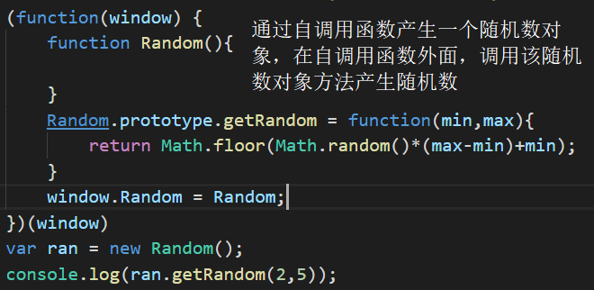
# 解决闭包的方法
1. IIFE解决
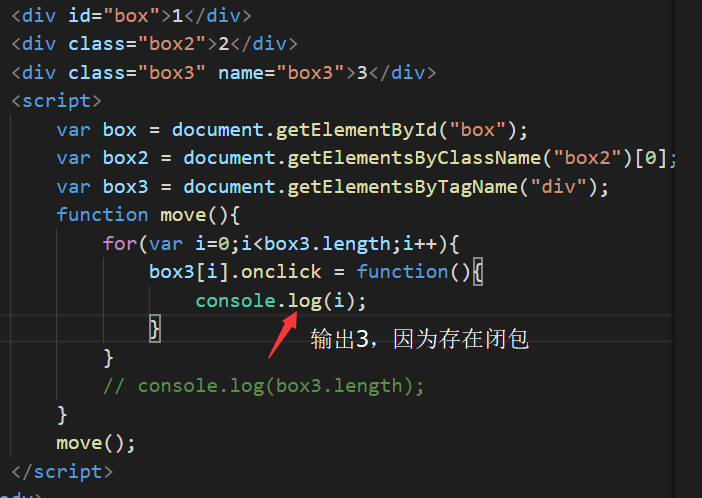
解决方法：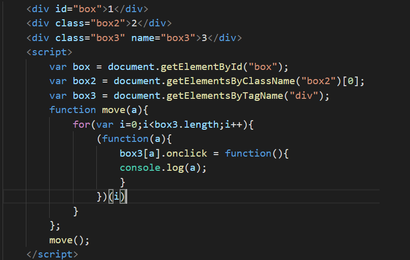
2. this关键字解决
* this只能用于函数内部，指代触发这个事件的对象，包括这个对象的所有属性和方法,解决方法：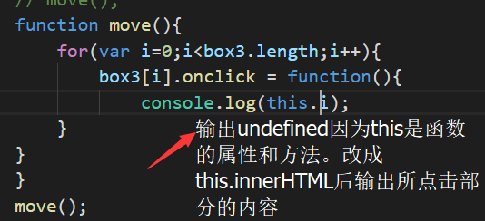
# js中的eventloop事件循环机制
https://www.cnblogs.com/hanzhecheng/p/9046144.html
# apply,call,bind用法与区别（403-507）
## 语法：
    函数/方法.call(obj(所指向的要利用的函数或对象),value,value)
    函数/方法.apply(obj,[value,value])
    函数/方法.call(obj,value,value)
    函数名字.bind(对象,参数1,参数2,...);返回值是复制之后的这个函数
    方法名字.bind(对象,参数1,参数2,...);返回值是复制之后的这个方法
### apply和call方法改变对象或函数的this指向,不同的地方：参数传递方式不一样.当onj=null时，默认this指向window
### 使用：只要是想使用别的对象的方法，并且希望这个方法是当前对象的,那么就可以使用apply/call
### bind方法是复制的意思，参数可以在复制的时候传入，也可以在复制之后调用的时候传入
### apply和call是调用的时候改变this的指向
### bind方法是复制一份的时候，改变了this的指向
# 深拷贝与浅拷贝
### 浅拷贝就是复制，相当于把一个对象的所有内容复制一份给另一个对象。拷贝还是复制，而他相对于浅拷贝的区别在于他复制数组和对象时，不是直接一块复制，而是一个一个的复制到另一个对象中
# 获取异步函数的值
* 利用回调函数
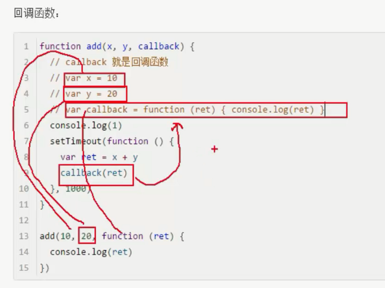
* 解释： 如果将callback(ret)替换成return ret,你会发现在外部执行add函数时值为undefined,因为setTimeout是异步的，会延后执行。所以只能把调用的add函数利用回调函数获取setTimeout里的值
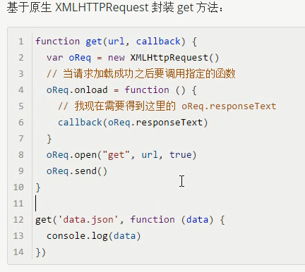
# ES6
## var let const
>var是函数作用域,let,const是块级作用域，不能像var一样存在变量提升。
>const一般声明常量，定义的值不可改变，但是如果送一的是一个对象，那么可以改变该对象的属性。
## 模板语法``
* `i am ${userName}`
## 给参数设置默认值
>目的：防止有时候调用函数不给参数时报错
```javaScript
function sum(flag=true){
    if(flag){
        return true
    }else{
        return false
    }
}
```
## 箭头函数
>用就完事了
## 解构
```javaScript
// 数组的解构
var [a,b,c] = [3,8,10]
console.log(a)//3
console.log(b)//8
console.log(c)//10

var [x,...y] = [4,8,5,1,0,6]
console.log(y) // [8,5,1,0,6],变成数组了
// 字符串的解构
var [x,y,z] = "Vue"
console.log(x:${x},y:${y},z:${z}) // x:V,y:u,z:e

let x = [...'ES6'] // ["E","S","6"]
// 对象的解构
var {n,m} = {m:10,n:20}
console.log(`m:${m},n:${n}`) // m:10,n:20//我没写错！
```
## 函数的rest参数和扩展
```javaScript
// 老方法
function sum (a,b,c){
    let total = 0;
    if(a) total+=a
    if(b) total+=b
    if(c) total+=c
    console.log(`tatal:${total}`)
}
sum(2,5,"") //这样才能保证没传c而不报错

// ES6的rest
function sum (...m){
    let total = 0;
    for(var i of m){
        tatal += i // i是m的每一项的值
    }
    console.log(`tatal:${total}`)
}
sum(2,5,4,8,9,10) //想传多少传多少

// 整个箭头函数
var sum = (...m) => {
    let total = 0;
    for(var i of m){
        tatal += i // i是m的每一项的值
    }
    console.log(`tatal:${total}`)
}

// rest参数和数组结合就会解构数组
var [x,y] = [4,8]
console.log(...[4,8]) //4 8

// rest参数合并数组
var arr1 = [1,3]; let arr2 = [2,4]
console.log([...arr1,...arr2]) // [1,3,2,4]
```
## Promise使用（node.js笔记有写）
>解决地狱回调
```javaScript
let checkLogin = function () {
  return new Promise(function (resolve, reject) {
    let flag = document.cookie.indexOf("userId")>-1?true:false;
    if(flag=true){
        resolve({
            status:0,
            result:true
        })
    }else{
        reject("error")
    }
  })
}

checkLogin()
  .then((res) => {
    if(res.status==0){
        console.log("login success");
    }  
  }).catch((error)=>{ // 捕获异常
      console.log(`errors:${error}`)
  })
```
## module.exports和ES6 import/export的使用
>module.exports，export导出，import导入
>使用export导出的东西，import导入时把名字用‘{}’包裹：
```javaScript
// app.js
export let sum = (x,y) => {
    return x+y
}
export let decrease = (x,y) => {
    return x-y
}
// 2.js
import {sum,decrease} from './app' //至于为什么没写‘js’,因为我全局配置的是js可省
console.log(`sum:${sum(6,1)}`) // 7

// 2.js的另一种写法
import * as app from './app' // 这样可以获取app.js中任何暴露的元素
console.log(`sum:${app.sum(6,1)}`) // 7
```