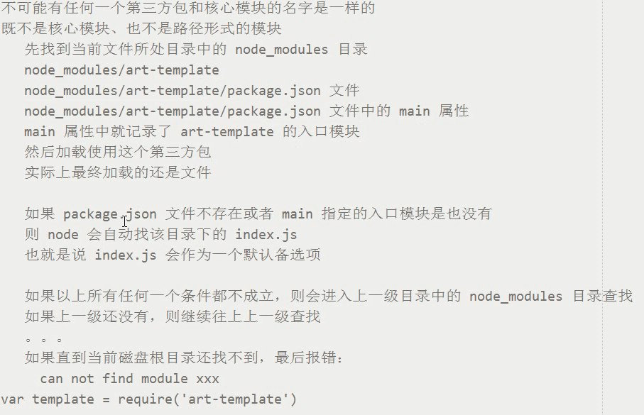

# node概述
- Node.js 是什么
  + JavaScript 运行时
  + 既不是语言，也不是框架，它是一个平台
- Node.js 中的 JavaScript
  + 没有 BOM、DOM
  + EcmaScript 基本的 JavaScript 语言部分
  + 在 Node 中为 JavaScript 提供了一些服务器级别的 API
    * 文件操作的能力
    * http 服务的能力
+ 核心模块
    * 核心模块是由 Node 提供的一个个的具名的模块，它们都有自己特殊的名称标识，例如
      - fs 文件操作模块
      - http 网络服务构建模块
      - os 操作系统信息模块
      - path 路径处理模块
      - 。。。。
    * 所有核心模块在使用的时候都必须手动的先使用 `require` 方法来加载，然后才可以使用，例如：
      - `let fs = require('fs')`
    * 也可以有用户自己编名的模块，例如：`require(./b.js)`。则在该js文件引入其他js文件，可以省略b后的'js'
    * 导出模块： exports,该模块导出一个对象，通过‘对象.方法’可以在其他地方调用该模块的方法
# CommonJS模块规范
## 使用 `require` 方法来加载模块
```
语法：let 自定义变量名称 = require(模块)
```
- 两个作用:
  * 执行被加载模块中的代码
  * 得到被加载模块中的exports导出接口对象
## 使用 `exports` 接口对象用来导出模块中的成员
* node中是模块作用域，默认文件中的所有成员只在当前文件模块起作用
* 对于希望让其他模块也用到的东西用exports导出
```
语法：
`b.js`
exports.add = function (x,y) { console.log(x+y) }
使用： var a = require('./b')
      a.add(2,4) // 6
```
## 使用 `module.exports` 接口对象用来导出模块中的成员
* exports是module.exports的一个引用
  * `module.exports===exports // true`
## exports 和 module.exports
* 导出多个成员：
```
module.exports = {}
或： exports.xxx = xxx
```
* 导出单个成员：
module.exports = xxx
# path路径操作模块
* path.basename
  * 获取一个路径的文件名（默认包含扩展名）
* path.dirname
  * 获取一个路径中的目录部分
* path.extname
  * 获取一个路径中的扩展名部分
* path.parse
  * 把一个路径转为对象
    * root根路径
    * dir目录
    * base文件名
    * ext扩展名部分
    * name文件名（默认不包含扩展名）
* path.join
  * 当需要进行路径拼接的时候使用
* path.isAbsolute
  * 判断一个路径是否为绝对路径
# Node中的其他成员
>在每个模块中，出了require、exports等模块相关API之外，还有两个特殊的成员：
* `__dirname`:可以用来获取当前文件模块所属目录的绝对路径
* `__filename`:可以用来获取当前文件的绝对路径
* `__dirname`和`__filename`是不受执行node命令所处的路径影响的
>在稳健操作中，使用相对路径是不可靠的，因为在node中稳健操作的路径被设计为**相对于执行node命令所处的路径**
* 所以为了解决这个问题，只需要把相对路径变为绝对路径即可
```javaScript
let path = require('path')
fs.readFile(path.join(__dirname,'./a.txt'),'utf8',(err,data) => {
  if (err){
    throw err
  }
  console.log(data)
})
```
# 作用域
* node没有全局作用域，只有模块作用域
# ip地址和端口号
* ip 地址用来定位计算机
* 端口号用来定位具体的应用程序，所有需要联网通信的应用程序都会占用一个端口号
# node文件
## 读文件
* 两个参数:
  - url
  - error:成功时为null
  - data:失败时为undefined

```javaScript
let fs = require('fs') // 加载文件模块

fs.readFile('1.txt',(error,data) => { // 读取文件
  console.log(data.toString()) // 成功则返回data，toString将二进制转为正常语言
})
```
## 写文件
* 第一个参数：文件路径
* 第二个参数：文件内容
* 第三个参数：回调函数(只有error这个形参)
```javaScript
let fs = require('fs')

fs.writeFile('1.txt','我时sha',(error) => {
  if(error) {
    console.log("文件写入失败")
  }else{
    console.log("文件写入成功")
  }
})
```
# http
* 监听 request 请求事件,两个参数：
  + request: 接收浏览器发送的请求
  + responce: 响应请求
    - response 对象有一个方法：write 可以用来给客户端发送响应数据，write 可以使用多次，但是最后一定要使用 end 来结束响应，否则客户端会一直等待
```javaScript
// 1. 加载 http 核心模块
var http = require('http')

// 2. 使用 http.createServer() 方法创建一个 Web 服务器
//    返回一个 Server 实例
var server = http.createServer()

// 3.监听 request 请求事件，设置请求处理函数
server.on('request', (request, response) => {
  console.log('收到客户端的请求了，请求路径是：' + request.url)

  response.write('hello')
  response.write(' nodejs')

  // 告诉客户端，我的话说完了，你可以呈递给用户了
  response.end()
})

// 3的另一种写法
server.on('request', function (req, res) {
  console.log('收到请求了，请求路径是：' + req.url)
  console.log('请求我的客户端的地址是：', req.socket.remoteAddress, req.socket.remotePort)

  // 根据不同的请求路径发送不同的响应结果
  // 1. 获取请求路径
  //    req.url 获取到的是端口号之后的那一部分路径
  //    也就是说所有的 url 都是以 / 开头的
  // 2. 判断路径处理响应

  var url = req.url

  if (url === '/') {
    res.end('index page')
  } else if (url === '/login') {
    res.end('login page')
  } else if (url === '/products') {
    var products = [{
        name: '苹果 X',
        price: 8888
      },
      {
        name: '菠萝 X',
        price: 5000
      },
      {
        name: '小辣椒 X',
        price: 1999
      }
    ]

    // 响应内容只能是二进制数据或者字符串
    // JSON.parse:转为数组  JSON.stringify：转为字符串
    res.end(JSON.stringify(products))
  } else {
    res.end('404 Not Found.')
  }
})

// 4. 绑定端口号，启动服务器
server.listen(3000, function () {
  console.log('服务器启动成功了，可以通过 http://127.0.0.1:3000/ 来进行访问')
})
```
* 在服务端默认发送的数据，其实是 utf8 编码的内容，但是浏览器不知道你是 utf8 编码的内容
  - 解决方法就是在 http 协议中，Content-Type 就是用来告知对方我给你发送的数据内容是什么类型
    - Content-Type对照表：(http://tool.oschina.net/commons) 
```javaScript
server.on('request', function (req, res) {
  let url = req.url
  if (url === '/plain') {
    // text/plain 就是普通文本 ,charset表示编码格式
    res.setHeader('Content-Type', 'text/plain', charset=utf-8')
    res.end('hello 世界')
  } else if (url === '/html') {
    // 如果你发送的是 html 格式的字符串，则也要告诉浏览器我给你发送是 text/html 格式的内容
    res.setHeader('Content-Type', 'text/html; charset=utf-8')
    res.end('<p>hello html <a href="">点我</a></p>')
  }
})
```
# 模板引擎
* 目的：服务端也具有模版渲染的能力 
* 模版引擎不关心内容，只关心标记{{}}，模板引起最早就是诞生于服务器领域，后来才发展到了前端。

* 步骤： 
1. 安装 npm install art-template 
2. 在需要使用的文档模块中加载art-template，只需要使用require方法加载就可以了 `require(‘art-template’)`
3. 如下代码`template.render(data.toString(), {渲染的内容})`
```javaScript
var comments = [
  {
    name: '张三',
    message: '今天天气不错！',
    dateTime: '2015-10-16'
  },
  {
    name: '张三2',
    message: '今天天气不错！',
    dateTime: '2015-10-16'
  },
  {
    name: '张三3',
    message: '今天天气不错！',
    dateTime: '2015-10-16'
  },
]
http
  .createServer(function (req, res) { // 简写方式，该函数会直接被注册为 server 的 request 请求事件处理函数
  // 使用 url.parse 方法将路径解析为一个方便操作的对象，第二个参数为 true 表示直接将查询字符串转为一个对象（通过 query 属性来访问）
  var parseObj = url.parse(req.url, true)

  // 单独获取不包含查询字符串的路径部分（该路径不包含 ? 之后的内容）
  var pathname = parseObj.pathname
  if (pathname === '/') {
    fs.readFile('./views/index.html', function (err, data) {
      if (err) {
        return res.end('404 Not Found.')
      }
      var htmlStr = template.render(data.toString(), {
        comments: comments
      })
      res.end(htmlStr)
    })
  }
```
4. 
```html
<ul class="list-group">
  {{each comments}}  // each是art-template模版语法
  <li class="list-group-item">{{ $value.name }}说：{{ $value.message }} <span class="pull-right">{{ $value.dateTime }}</span></li>
  {{/each}}
</ul>
```
- 服务端渲染和客户端渲染的区别
  + 客户端渲染不利于 SEO 搜索引擎优化
  + 服务端渲染是可以被爬虫抓取到的，客户端异步渲染是很难被爬虫抓取到的
  + 所以你会发现真正的网站既不是纯异步也不是纯服务端渲染出来的
  + 而是两者结合来做的
  + 例如京东的商品列表就采用的是服务端渲染，目的了为了 SEO 搜索引擎优化
  + 而它的商品评论列表为了用户体验，而且也不需要 SEO 优化，所以采用是客户端渲染
# url解析路径
* 步骤一：`var url = require('url')`
* 步骤二：`var parseObj = url.parse(req.url, true)`
  - 使用 url.parse 方法将路径解析为一个方便操作的对象，第二个参数为 true 表示直接将查询字符串转为一个对象（通过 query 属性来访问）
* url.parse方法一：`var pathname = parseObj.pathname`
  * 单独获取不包含查询字符串的路径部分（该路径不包含 ? 之后的内容）
* url.parse方法二：`var comment = parseObj.query`
  * 获取路径?后的内容
# 通过服务器让客户端重定向
* 1. 状态码statusCode设置为 302 临时重定向
* 2. 在响应头setHeader中通过 Location 告诉客户端往哪儿重定向
  * 如果客户端发现收到服务器的响应的状态码是 302 就会自动去响应头中找 Location ，然后对该地址发起新的请求，就能看到客户端自动跳转了
```
res.statusCode = 302 // 临时重定向
res.setHeader('Location', '/')
res.end()
```
# 如何加载模块

# 修改完代码自启动
安装：`npm install --global nodemon`
使用：`nodemon 文件`
# express
* 安装：`npm install express --save`
* 使用：
```javaScript
var express = require('express')

var app = express()

app.get('/', function (req, res) {
  res.send('hd33djs')
})

app.listen(3000,function () {
  console.log("running.....")
})
```
## express 引入文件
* app.js: `app.use('/public/',express.static('public'))`
* 浏览器：`http://127.0.0.1:3000/public/css/main.css` 
## 在express中使用art-template模版引擎
* 官方文档：(https://aui.github.io/art-template/)
* 安装：`npm install --save art-template express-art-template`
* 配置模版引擎：
  `app.engine('art(默认文件后缀，通常改为html)', require('express-art-template'));`
* 使用：
```javaScript
app.get('/', function (req, res) {
  // express会默认从views文件目录去找index.html,
  // 如果想修改默认的views文件目录，app.set('vies',目录路径)
  res.render('index.html',{
    title: '哈哈'
  })
})
```
## 在express中获取表单get请求参数：
* `req.query`
## 在express中获取表单post请求参数：
* express没有提供post的api，但是有一个body-parser中间件,然后用req.body获取参数
* 安装： `npm install --save body-parser`
* 使用：
```javaScript
var express = require('express')
var bodyParser = require('body-parser')

var app = express()

// create application/json parser
var jsonParser = bodyParser.json()

// create application/x-www-form-urlencoded parser
var urlencodedParser = bodyParser.urlencoded({ extended: false })

// POST /login gets urlencoded bodies
app.post('/login', urlencodedParser, function (req, res) {
  if (!req.body) return res.sendStatus(400)
  res.send('welcome, ' + req.body.username)
})

// POST /api/users gets JSON bodies
app.post('/api/users', jsonParser, function (req, res) {
  if (!req.body) return res.sendStatus(400)
  // create user in req.body

// 我的写法：
var bodyParser = require('body-parser')
app.use(bodyParser.json())
app.use(bodyParser.urlencoded({ extended: false })) 
app.post('/post', function (req, res) {
  var comment = req.body
  comment.dateTime = '2019-05-01 06:11:22'
  comments.unshift(comment)
  res.redirect('/')
})
```
## 在express中使用路由
* var router = express('./router')
* `app.use(router)`
* 使用：
```java
// 1.app.js
var router = require('./router')
// 把路由容器挂载到 app 服务中
app.use(router)
// 2. router.js 创建一个路由容器
var express = require('express')
var router = express.Router()
router.get('/students', function (req, res) {})
module.exports = router
```
# mongodb
* 下载（https://www.cr173.com/soft/34691.html）
* 配置环境变量
* 检验是否成功：`mongod --version`
* 开启数据库
  * c盘新建data目录、data目录新建db目录（默认的数据存储目录）
  * 命令行：`mongod`
  * 如果想要修改：mongod --dbpath=数据存储目录路径（不推荐）
* 停止数据库：
  * ctrl+c
* 连接数据库
  * 新建另一个命令行：`mongo`
* 退出连接
  * 命令行：`exit`
## mongodb基本命令
* show dbs
  * 查看显示所有数据库
* db
  * 查看当前操作的数据库
* use 数据库名称
  * 切换到指定的数据（如果没有会新建）
## mongodb数据库基本概念
* 可以有多个数据库
* 一个数据库中可以有多个集合（表）
* 一个集合中可以有多个文档（表记录）
* 文档结构灵活，没有任何限制
* mongodb非常灵活，不需要像mySQL一样先创建数据库、表、设计表结构
  * 当你需要插入数据的时候，只需要指定往哪个数据库的哪个集合操作就可以了
  * 一切都由mongodb来自动完成建库建表
```javaScript
{
  qq: { // 数据库名
    users:[ // 表名
      {name:'张三',age:15} // 表记录
      {name:'张三',age:15}
      {name:'张三',age:15}
      {name:'张三',age:15}
      ···
    ]，
    products: [

    ],
    ···
  },
  taobao: {

  },
  baidu: {

  }
  ···
}
```
## 在node中操作mongodb数据
>使用官方的mongodb包操作
* （https://elemefe.gitbooks.io/mongodb/content/introduction/getting-started.html）
>使用第三方mongoose来操作mongodb数据库
* （https://mongoosejs.com）
* 装包：`npm i mongoose`
* hello world
```javaScript
const mongoose = require('mongoose');
mongoose.connect('mongodb://localhost:27017/test', {useNewUrlParser: true});

const Cat = mongoose.model('Cat', { name: String });

const kitty = new Cat({ name: 'Zildjian' });
kitty.save().then(() => console.log('meow'));
```
> 官方指南
1. 设计Schema发布Model
```javaScript
var mongoose = require('mongoose')

var Schema = mongoose.Schema

// 1. 连接数据库
// 指定连接的数据库不需要存在，当你插入第一条数据之后就会自动被创建出来
mongoose.connect('mongodb://localhost/itcast')

// 2. 设计文档结构（表结构）
// 字段名称就是表结构中的属性名称
// 约束的目的是为了保证数据的完整性，不要有脏数据
var userSchema = new Schema({
  username: {
    type: String,
    required: true // 必须有
  },
  password: {
    type: String,
    required: true
  },
  email: {
    type: String
  }
})

// 3. 将文档结构发布为模型
//    mongoose.model 方法就是用来将一个架构发布为 model
//    第一个参数：传入一个大写名词单数字符串用来表示你的数据库名称
//                 mongoose 会自动将大写名词的字符串生成 小写复数 的集合名称
//                 例如这里的 User 最终会变为 users 集合名称
//    第二个参数：架构 Schema
//
//    返回值：模型构造函数
var User = mongoose.model('User', userSchema)
```
2. 增加数据
```javaScript
var admin = new User({
  username: 'zs',
  password: '123456',
  email: 'admin@admin.com'
})

admin.save(function (err, ret) {
  if (err) {
    console.log('保存失败')
  } else {
    console.log('保存成功')
    console.log(ret)
  }
})
```
3. 查询数据
```javaScript
User.find(function (err, ret) { // 查询所有数据
  if (err) {
    console.log('查询失败')
  } else {
    console.log(ret)
  }
})

User.find({ // 查询username: 'zs'的数据，得到的是一个数组对象
  username: 'zs'
}, function (err, ret) {
  if (err) {
    console.log('查询失败')
  } else {
    console.log(ret)
  }
})

User.findOne({// 查询username: 'zs'的数据，得到的是一个对象
  username: 'zs'
}, function (err, ret) {
  if (err) {
    console.log('查询失败')
  } else {
    console.log(ret)
  }
})
```
4. 删除数据
```javaScript
User.findByIdAndRemove({
  username: 'zs'
}, function (err, ret) {
  if (err) {
    console.log('删除失败')
  } else {
    console.log('删除成功')
    console.log(ret)
  }
})
```
5. 更新数据
```javaScript
User.findByIdAndUpdate('5a001b23d219eb00c8581184', {
  password: '123'
}, function (err, ret) {
  if (err) {
    console.log('更新失败')
  } else {
    console.log('更新成功')
  }
})
```
# promise
callback-hell:因为读取文件是异步的，so读取顺序不知
```javaScript
var fs = require('fs')

fs.readFile('./data/a.txt', 'utf8', function (err, data) {
  if (err) {
    // return console.log('读取失败')
    // 抛出异常
    //    1. 阻止程序的执行
    //    2. 把错误消息打印到控制台
    throw err
  }
  console.log(data)
  fs.readFile('./data/b.txt', 'utf8', function (err, data) {
    if (err) {
      // return console.log('读取失败')
      // 抛出异常
      //    1. 阻止程序的执行
      //    2. 把错误消息打印到控制台
      throw err
    }
    console.log(data)
    fs.readFile('./data/c.txt', 'utf8', function (err, data) {
      if (err) {
        // return console.log('读取失败')
        // 抛出异常
        //    1. 阻止程序的执行
        //    2. 把错误消息打印到控制台
        throw err
      }
      console.log(data)
    })
  })
})
```
promise:new Promise是立即执行，resolve表示成功，reject表示失败。then方法的第一个参数是执行成功的函数，第二个参数是失败时执行的函数
```javaScript
var fs = require('fs')

var p1 = new Promise(function (resolve, reject) {
  fs.readFile('./data/a.txt', 'utf8', function (err, data) {
    if (err) {
      reject(err)
    } else {
      resolve(data)
    }
  })
})

var p2 = new Promise(function (resolve, reject) {
  fs.readFile('./data/b.txt', 'utf8', function (err, data) {
    if (err) {
      reject(err)
    } else {
      resolve(data)
    }
  })
})

var p3 = new Promise(function (resolve, reject) {
  fs.readFile('./data/c.txt', 'utf8', function (err, data) {
    if (err) {
      reject(err)
    } else {
      resolve(data)
    }
  })
})

p1
  .then(function (data) {
    console.log(data)
    // 当 p1 读取成功的时候
    // 当前函数中 return 的结果就可以在后面的 then 中 function 接收到
    // 当你 return 123 后面就接收到 123
    //      return 'hello' 后面就接收到 'hello'
    //      没有 return 后面收到的就是 undefined
    // 上面那些 return 的数据没什么卵用
    // 真正有用的是：我们可以 return 一个 Promise 对象
    // 当 return 一个 Promise 对象的时候，后续的 then 中的 方法的第一个参数会作为 p2 的 resolve
    // 
    return p2
  }, function (err) {
    console.log('读取文件失败了', err)
  })
  .then(function (data) {
    console.log(data)
    return p3
  })
  .then(function (data) {
    console.log(data)
    console.log('end')
  })
```
封装promise:
```javaScript
var fs = require('fs')

function pReadFile(filePath) {
  return new Promise(function (resolve, reject) {
    fs.readFile(filePath, 'utf8', function (err, data) {
      if (err) {
        reject(err)
      } else {
        resolve(data)
      }
    })
  })
}

pReadFile('./data/a.txt')
  .then(function (data) {
    console.log(data)
    return pReadFile('./data/b.txt')
  })
  .then(function (data) {
    console.log(data)
    return pReadFile('./data/c.txt')
  })
  .then(function (data) {
    console.log(data)
  })
```