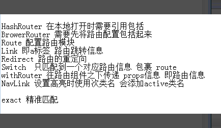
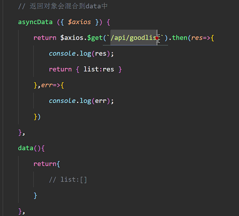
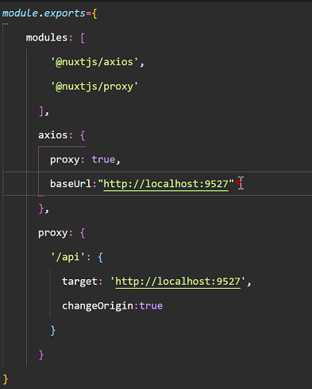
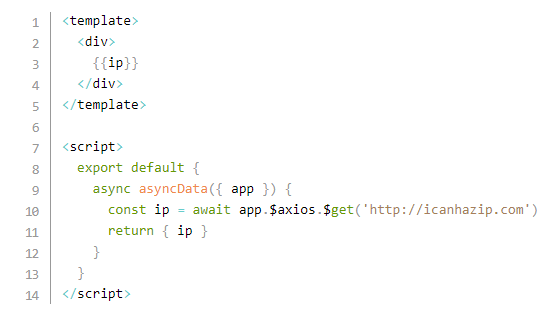

# 插值
```jsx
function Ipt(props){
  console.log(props);
  return <div>{props.children[0]}-----------{props.children[1]}</div>
}
var x=100
ReactDOM.render(
  <div>
    <Ipt>
      <div>hello</div>
      <div>world</div>
    </Ipt>
  </div>,
  document.getElementById("app")
)
```
# 动态组件
```jsx
function One(){
    return <h1>One</h1>
}
function Two(){
    return <h1>Two</h1>
}
function Three(){
    return <h1>Three</h1>
}
function Component(props){
    return <props.is></props.is>
}
var num=2;
var c;
if(num==0){
    c=One
}else if(num==1){
    c=Two
}else{
    c=Three;
}
ReactDOM.render(
    <div>
        <Component is={c}/>
    </div>,
    document.getElementById("app")
)
```
# dom
*  `ReactDOM.unmountComponentAtNode(node)`:移出节点
# 性能优化----shouldComponentUpdate 
> 因为组件内部调用setState 当前组件及子组件都会重新渲染 Mount生命周期并不会重复执行,但是子组件有时不需要更新,为了优化性能采用shouldComponentUpdate
* shouldComponentUpdate决定组件是否重新渲染 return true表示渲染
```jsx
// 父组件
// App——挂载前只会输出一次因为生命周期并不会重复执行

shouldComponentUpdate(newProps,newState){
  return this.state.x!==newState.x
}
componentWillMount(){
  console.log("App——挂载前")
}
componentWillUpdate(){ // 会执行多次,所以想要更新后的数据在这里写
  console.log("App——挂载前----update"+x) 
}
// 子组件
// 这样写使父组件更新时子组件视图不会更新
shouldComponentUpdate(newProps,newState){
  return false
}
componentWillMount(){ // 由于设置了false,代表不更新组建,所以只在初始化的时候输一次
  console.log("Index——render")
}
componentWillUpdate(){ // 由于设置了false,代表不更新组建,所以不输出任何
  console.log("Index——render")
}
```
> 但是,以上均可忽略,采用class Index extends React.PureComponent,注意PureComponent直接将shouldComponentUpdate封装好了,表示父组件更新子组件不更新
# 路由

# redux
* 获取公共状态通过store.getState()
```jsx
var store = Redux.createStore((state,action=>{
  return { // return的是store的最新状态
    x:10,
    y:20
  }
}))

```
# nuxt
> nuxt是用于服务端的构建工具,有利于搜索引擎搜索,利于抓取网页内容
* 关于跨域与axios
* 
* 
* 