# v-cloak
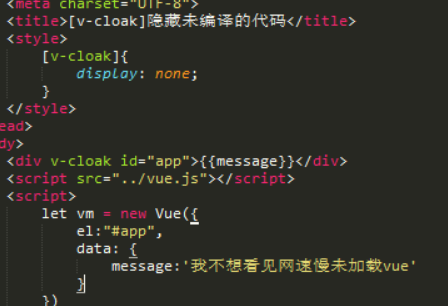
# v-text
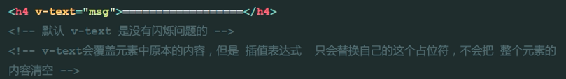
# v-html
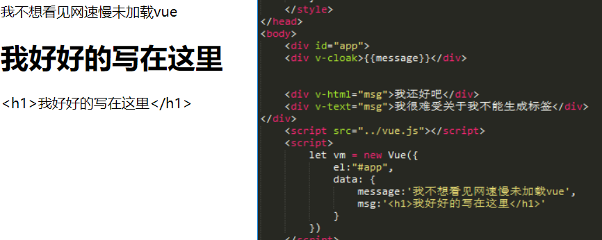
### v-text和v-html都会覆盖掉原来的内容
# v-bind属性绑定指令
### v-bind 简写为":要绑定的变量名"。只能单向绑定，不能双向
### v-bind:属性，如
    <input type="button" v-bind:title="变量名">
#### v-bind对于class的设置
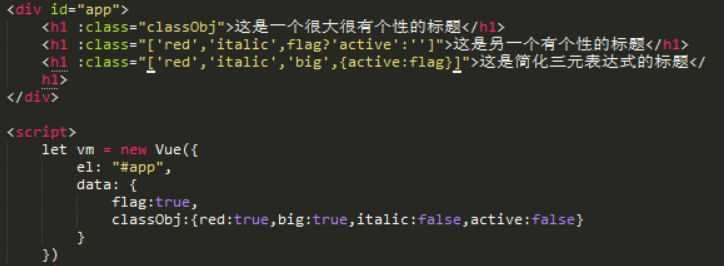
# v-model实现数据双向绑定
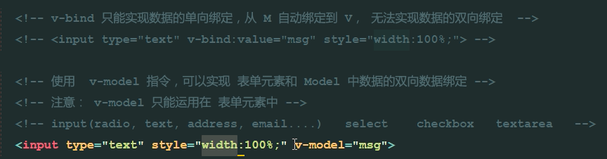
### 可运用在计算器
> 原生js实现双向数据绑定一般是通过操作dom监听一个'keyup'事件，然后`dom.innerText=event.target.value`
>而vue会有一个defineProperty方法，该方法接收三个参数，同时内置get,set方法，实时监听。机制如下：
```html
<input type="text" id="userName">
<span id="uName"></span>
```
```javaScript
let obj={
    pwd:"123"
}
Object.defineProperty(obj,"userName",{
    get: function() {
        // 当获取userName里面的东西时，get会实时触发
    },
    set: function() {
        // 当userName的里面的东西发生改变时，set函数会监听到，并触发set事件
    }
})
```
# v-on事件绑定机制
### bind绑定的变量写在data中，on绑定的是事件，写在methods中，缩写“@”
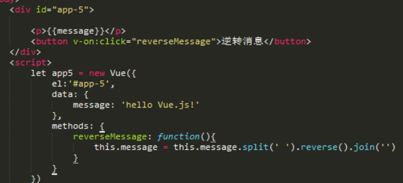
## v-on的事件缩写
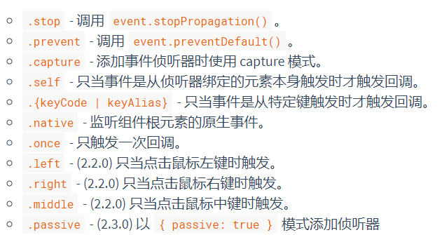
# v-for循环
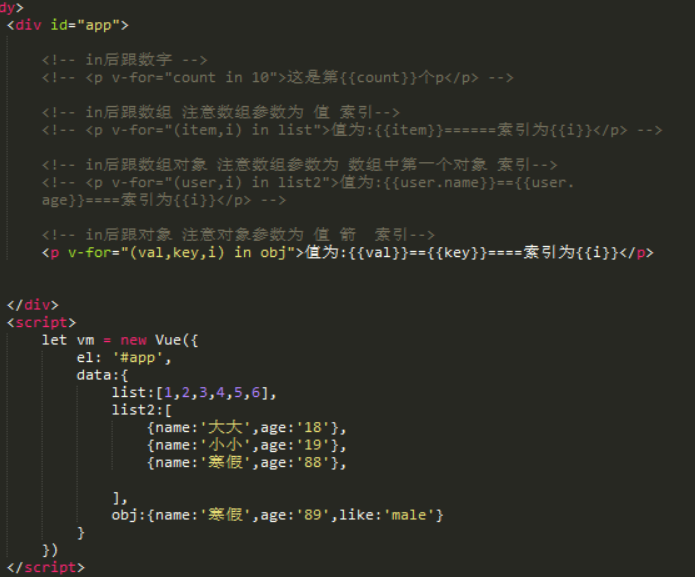
### 使用v-for时如果有问题注意规定 key值，且必须是in后面的东西的内容之一，且必须为字符串/数字
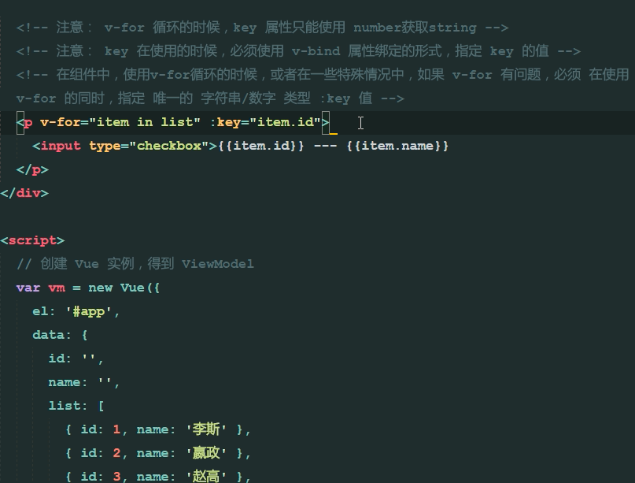
# 过滤器
### 语法：[内容|过滤器名称（可加参数，可有多个过滤器）]
> 全局过滤器

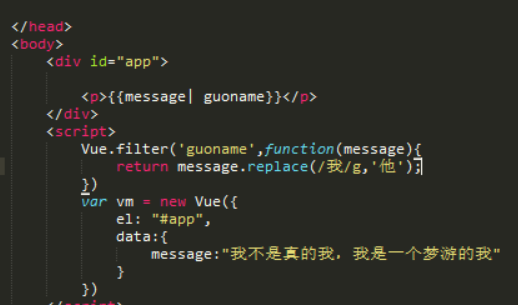
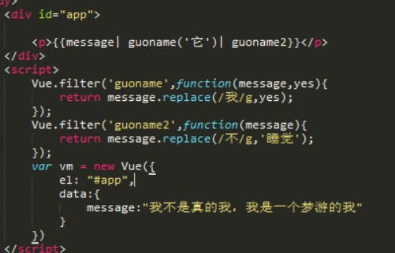

> 私有过滤器

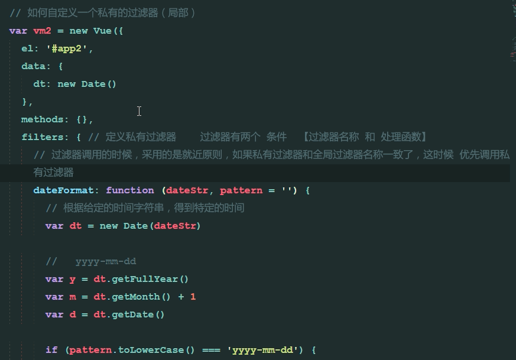

## 全局时间过滤器，用于过滤已给时间
* 首先引入日期处理类库
    * 命令行：cnpm i moment -S
* 之后导入这个库
    * import moment from 'moment'
    Vue.filter('dataFormat',function(datastr,pattern = "YYYY-MM-DD HH:mm:ss"){
        return moment(datastr).format(pattern);
    })
    <span>{{item.add_time | dataFormat}}</span>
    如果不想要时间可以写成 <span>{{item.add_time | dataFormat('YYYY-MM-DD')}}</span>
# 按键修饰符
### 系统自带的有@keyup.enter/tab/delete/.esc/space/up/down/left/right
> vue中鼠标的‘enter箭’：`@keyup.enter.exact="search()"`,加exact为了防止同时按别的键也触发enter事件
### 自定义全局按键修饰符方法：
    Vue.config.keyCodes.f2=113;
# 自定义全局指令，钩子函数
> 自定义全局指令：

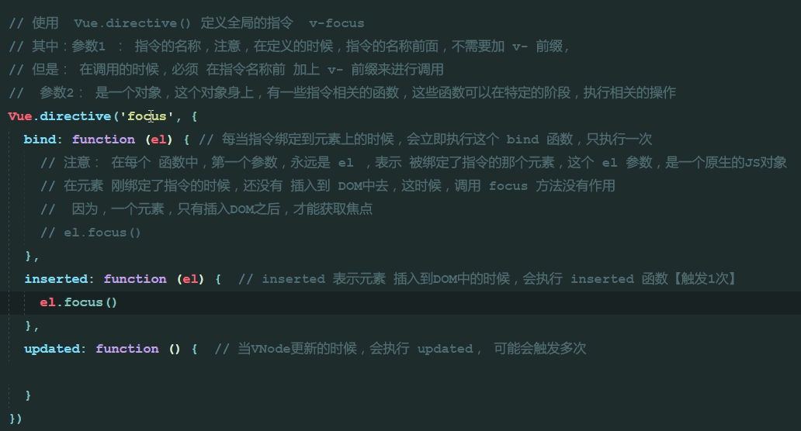
> 自定义私有指令：

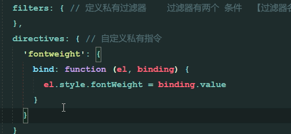

> 指令简写：

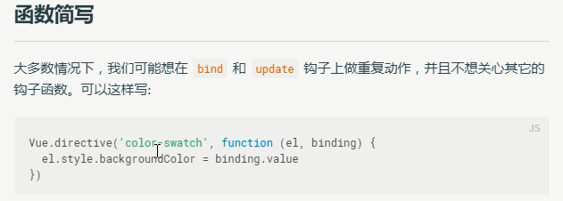
# 生命周期

# 动画
## 半场动画
### 钩子函数自定义动画，此时可分别设置进入动画与离开动画
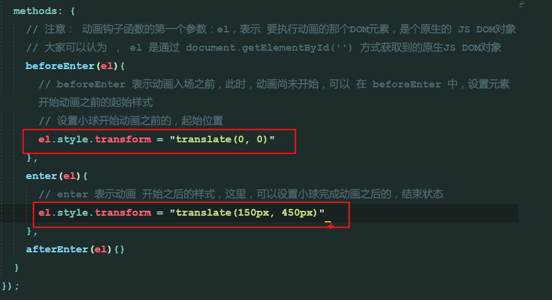

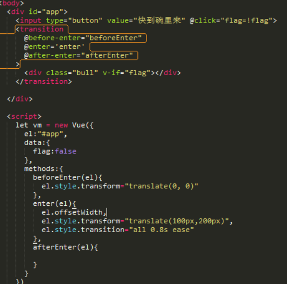

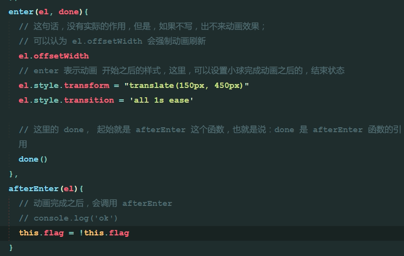
### v-enter 和 v-leave-to 设置动画的起始状态；
### v-enter-to 和 v-leave 设置动画的结束状态；
### v-enter-active 和 v-leave-active 设置动画的过渡时间和过渡效果。
* 当把 v-enter设置为transform:translateX(100%),v-leave-to设置为transform:translateX(-100%)可以解决两个页面切换时原本显示的那个页面要完全移除后才能切换到另一个页面的问题，即实现出去的往左，进来的也往左的效果
* 当把v-leave-to设置为position:absolute时，可解决动画占位问题
### 局部动画与全局动画，此时进入动画与离开动画只能是一样的
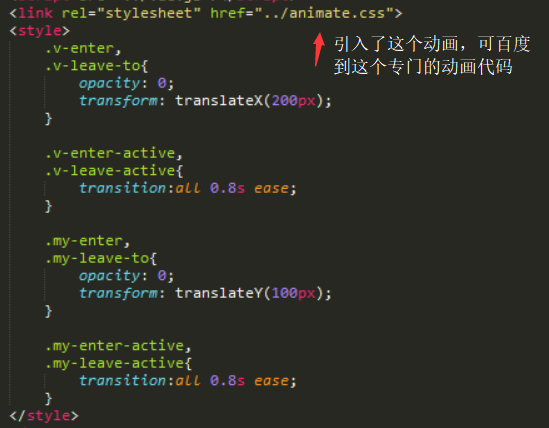
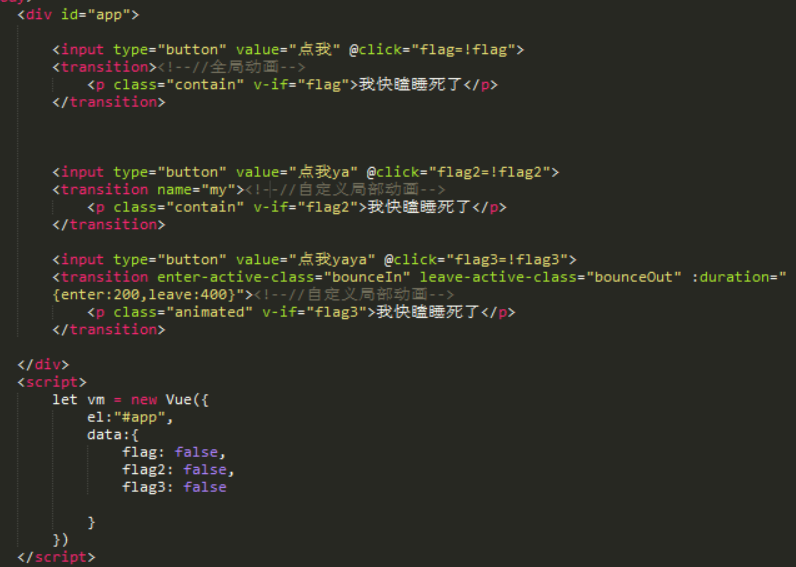
### 当用v-for循环渲染元素时，要想新增的元素也有动画，方法transition-group：
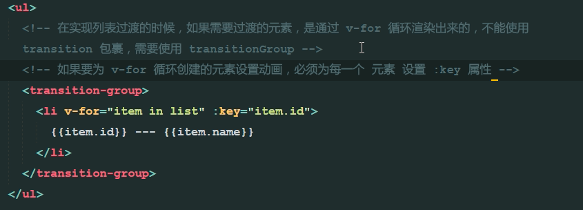
### v-move和v-leave-active
#### 他们跟v-enter一样，只用在style中设置就行，不用添加到标签里
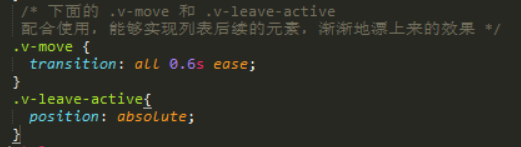
### appear和tag.png
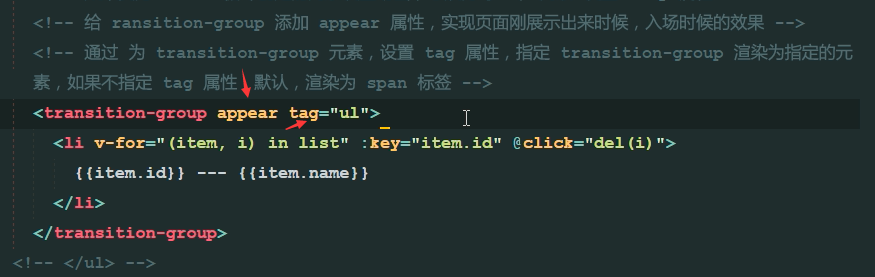

# 组件
## 创建组件的麻烦方法
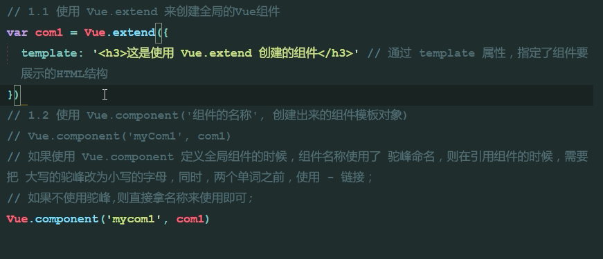
## 创建组件的不太麻烦方法
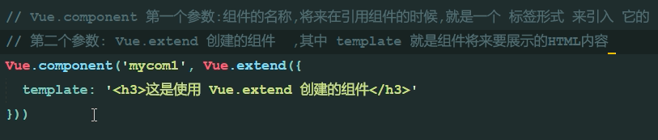
## 创建组件的日常简单方法

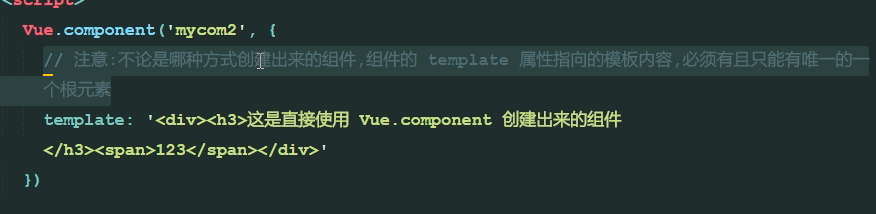
## 创建组件的日常简单且有提示的方法
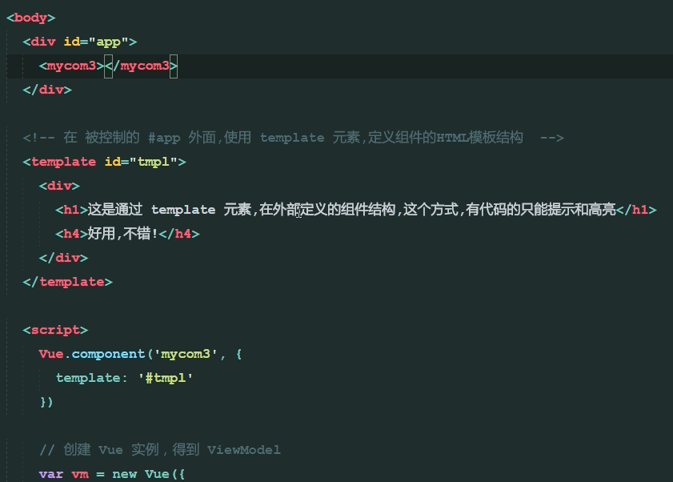
## 定义内部私有组件
### 天下方法一大家，私有组件，私有过滤器，私有指令，都是统一和methods使用一样的，且内部第一个总是名字。
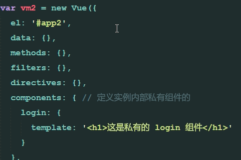
## 注意：
### 不论是以哪种方式创建的组件，组建的template属性指向的模版内容必须有一个根标签
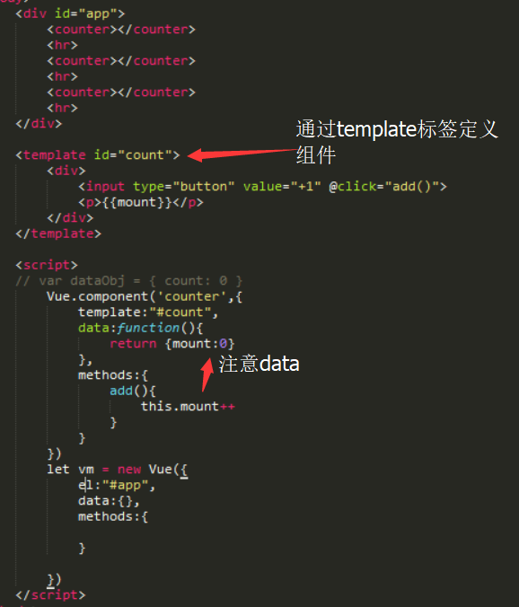
## 解析组件里的data
### 组件里的data必须是一个function,且必须返回一个对象，这是为什么呢？因为当页面有多个相同组件时，为了避免他们的数据因为其中一个组件变化而变化，在每次调用组建时，通过data这个function，使每个组件都要运行一下，从而刷新组件定义的属性，质疑为什么要返回一个对象，也是为了避免数据同步变更
## 组件切换
> 只能切换两个组件

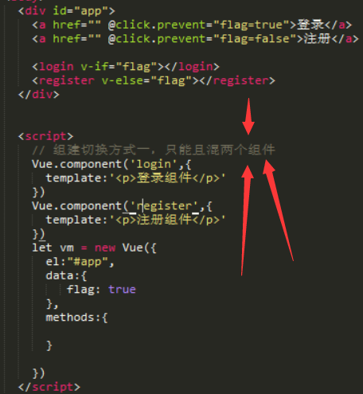

> 能切换多个组建（:is="组建名字"）

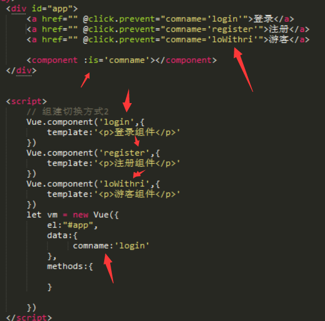

> 组建切换的动画效果

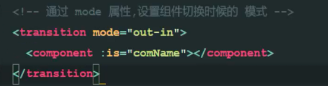
## 父组件向子组件传递属性（子组件引用父组件属性）
(https://www.jb51.net/article/140581.htm)
### 方法1：prop 需要在父组件com1上写
    <com1 :属性="要引用的变量"></com1>
    <com1 :parentmsg="msg"></com1>
		子组件：
		props:["parentmsg"]
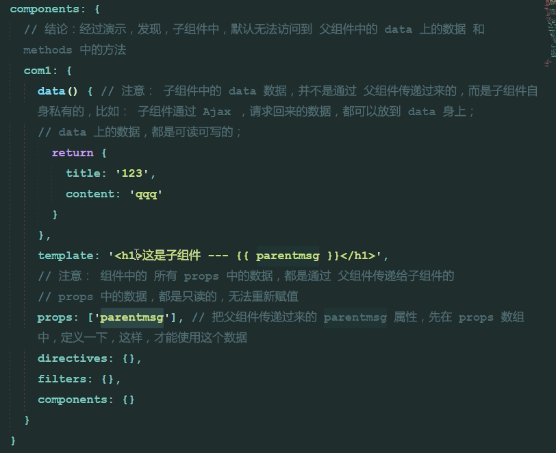
### 方法2：ref
	父组件：
		<child ref="msg">
		this.$refs.msg.getMessage('我是子组件')
	子组件：
		methods:{
			getMessage(m){
				this.message=m
			}
		}
## 子组件向父组件通信
	子组件:
		this.$emit(event(子组件定义事件),arg(子组件给父组件的值))
	父组件：
		event(父组件定义事件)
		<child @event(子组件定义的事件)="event(父组件定义事件)"></child>
### @fun=""
# ref获取dom对象,也可用于父组件调用子组件
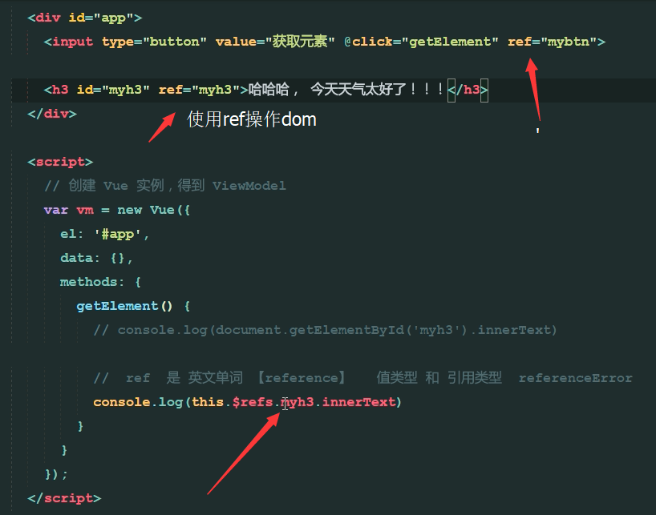
# 总结：
    vue提供的标签：component(专门用来实现组件切换),template,transition,transition-group
# router路由
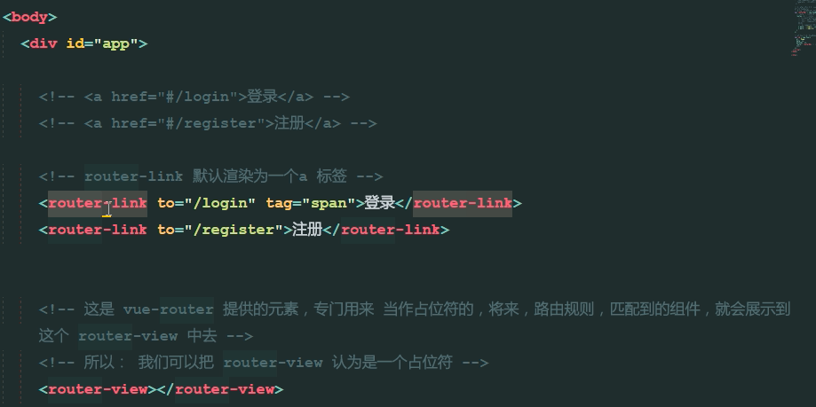
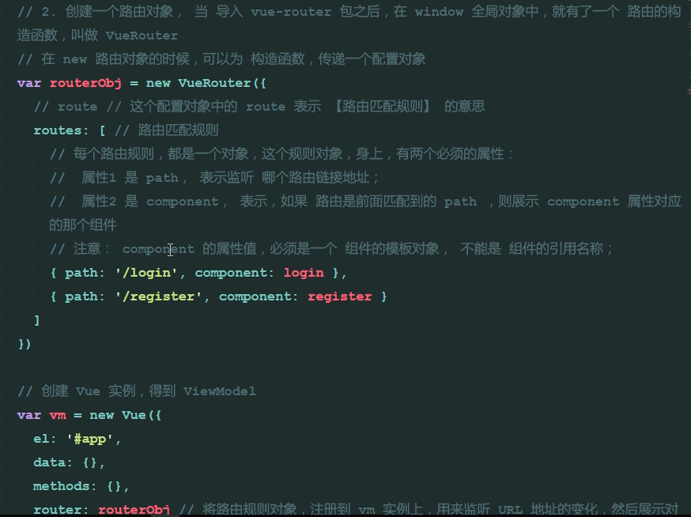
## 设置默认路由（redirect重定向）
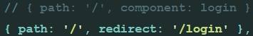
## linkActiveClass
### 在点击导航栏的时候，让被点击的那一个有背景色，其他的没有背景色？如何做？在路由里面设置:
    const router = new VueRouter({
        routes,
        linkActiveClass: 'is-active'2
    });
    然后在css里面设置:
    .is-active{
        background:red;
    }

### 这样<router-link>被点击激活的时候就会被加上is-active这个class了。注意如果没有设置router-link的标签类型，会是<a>标签,<a>标签是没有宽度和高度的。那么我们需要设置成div。然后才会背景颜色的变化。
* router-link 这样的a标签转化为li标签
    <router-link to='index' tag="li" event="mouseover">
## :冒号（绑定属性）之路由
> 当动态路由，即地址中有字符串的时候to前加：
    <router-link :to="'/home/newsinfo/'+item.id">
## router
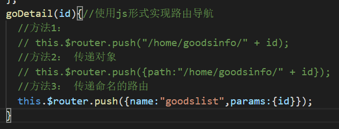
## 动态路由匹配
### 在嵌套路由中，父路由向子路由传值除了query外，还有params，params传值有两种情况，一种是值在url中显示，另外一种是值不显示在url中。
1、显示在url中
```javaScript
index.html
<div id="app">
	<!-- router-view 路由出口, 路由匹配到的组件将渲染在这里 -->
	<router-view></router-view>
    </div>

main.js params传值是通过 :[参数值] 如path: "/home/game/:num"

import Vue from 'vue'
import VueRouter from 'vue-router'
Vue.use(VueRouter)
//引入两个组件
import home from "./home.vue"
import game from "./game.vue"
//定义路由
const routes = [
	{ path: "/", redirect: "/home" },//重定向
	{
		path: "/home", component: home,
		children: [
			{ path: "/home/game/:num", component: game }
		]
	}
]
//创建路由实例
const router = new VueRouter({routes})
 
new Vue({
	el: '#app',
	data: {
		id:123,
	},
	methods: {
	},
	router
})
home.vue 在home中具体的值就跟在路径后面，如 “/home/game/123”，也就是说传递给子路由的值就是 123

<template>
	<div>
		<h3>首页</h3>
		<router-link to="/home/game/123">
			<button>显示</button>
		</router-link>
		<router-view></router-view>
	</div>
</template>
game.vue 在子路由中，通过 this.$route.params.参数名来接受传递过来的值

<template>
	<h3>王者荣耀{{ this.$route.params.num }}</h3>
    </template>
```
2、不显示在url中，如果在PC端将传递的值显示在url中，这样无形中就存在安全隐患，如果客户不小心修改了url那样就会出错，移动端就无所谓了，如何才能不显示在url中，同样很简单，但是需要给映射的路径起一个别名，通过name来取别名

同样只需将上面的main.js中的定义路由改为如下样子，在子路由中通过name来给路径其一个game1的别名。

```javaScript
//定义路由
const routes = [
	{ path: "/", redirect: "/home" },//重定向
	{
		path: "/home", component: home,
		children: [
			{ name: "game1", path: "/home/game/", component: game }
		]
	}
]

home.vue 中router-link修改为:to="{ name:'game1', params: {num: 123} }" params中是要传递的参数，这样传递的参数就不会显示在url中。

<template>
	<div>
		<h3>首页</h3>
		<router-link :to="{ name:'game1', params: {num: 123} }">
        	<button>显示</button>
        </router-link>
		<router-view></router-view>
	</div>
</template>
```
## this.$router this.$route有何区别？
> 1.$router为VueRouter实例，想要导航到不同URL，则使用$router.push方法

> 2.$route为当前router跳转对象，里面可以获取name、path、query、params等

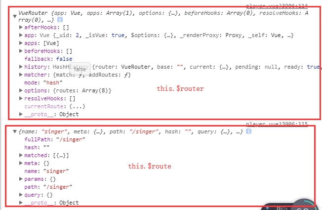
## vue-resource
(https://www.cnblogs.com/Juphy/p/7073027.html)
#### vue-resource是Vue.js的一款插件，它可以通过XMLHttpRequest或JSONP发起请求并处理响应。也就是说，$.ajax能做的事情，vue-resource插件一样也能做到，而且vue-resource的API更为简洁。另外，vue-resource还提供了非常有用的inteceptor功能，使用inteceptor可以在请求前和请求后附加一些行为，比如使用inteceptor在ajax请求时显示loading界面。
### vue-resource安装
(https://blog.csdn.net/qq_38209578/article/details/79227477)
	cnpm install vue-resource
### vue-resource使用:
* 1、引入vue-resource
    * script src="js/vue.js"
    * script src="js/vue-resource.js"
* 2.引入vue-resource后，可以基于全局的Vue对象使用http，也可以基于某个Vue实例使用http。
    > 基于全局Vue对象使用http
    * Vue.http.get('/someUrl', [options]).then(successCallback, errorCallback);
    Vue.http.post('/someUrl', [body], [options]).then(successCallback, errorCallback);  
    >在一个Vue实例内使用$http
    * this.$http.get('/someUrl', [options]).then(successCallback, errorCallback);
    this.$http.post('/someUrl', [body], [options]).then(successCallback, errorCallback);
### vue-resource emulateJSON的作用:
>如果Web服务器无法处理编码为application/json的请求，你可以启用emulateJSON选项。

>启用该选项后，请求会以application/x-www-form-urlencoded作为MIME type，就像普通的HTML表单一样。一般加上这个配置比较好


    Vue.http.options.emulateJSON = true;
## Vue.set
>如果在实例创建之后添加新的属性到实例上，它不会触发视图更新
* 解决办法：
1、通过Vue.set方法设置data属性（全局），如上：
`Vue.set(data,'sex', '男')`
2、您还可以使用 vm.$set实例方法，这也是局部 Vue.set方法的别名:
```javaScript
var key = 'content'; //这种主要用于当对象中某个属性值动态生成时处理方式
this.$set('info.'+key, 'what is this?');
 或
this.$set('info.content', 'what is this?');
或
this.$set(data,'content', 'what is this?');// data->content:what is this?
```
## v
## @click和:class结合
> 示例代码
```
data:{currentIndex:0}
<li v-for="(item,index) in List" :class="{'check':index==currentIndex}" @click="currentIndex=index"></li>`
```
* 点击某项li的时候，把currentIndex=index,然后class会判断index和currentIndex是否相等，然后改变li的样貌。这里可能会问怎么不直接在vue里面改变currentIndex然后改变class,因为这里这样写就不用去把之前有该样式的li设为false
# mui使用注意
### 当使用mui,mint-ui出现bug一定要去看官方文档。因为如mui中有时使用到js时有bug官方会告诉怎么解决
# 项目遇到的问题：
### 浏览器渲染页面之先来后到引发的问题
	<numbox style="display:inline"	@getcount="getSelectedCount" :max="goodsdetail.stock_quantity"><numbox>
>自定义了一个属性max，该属性是我用来向子组件传递属性的，此时我用了goodsdetail.stock_quantity。其中goodsdetail是我在data中定义的空对象，他用来接收服务器发送回来的数据的，我把max传递给子组件后，子组件却说max=undefined。因为在浏览器解析到:max=goodsdetail.stock_quantity时，我们的goodsdetail很有可能还没有获取到服务器传来的数据。但总有一个时刻他获取到了数据
* 解决办法：watch属性监听父组件传递过来的max值
	watch: {
      //max属性监听
      max:function(newVal,oldVal){
				//mui文档给numbox设置最大值，最小值，步长的js方法
        mui(".mui-numbox").numbox().setOption("max",newVal);
      }
    }
# 解决移动端1像素问题
## 因为手机端像素比通常比较高，为了防止1px在移动端出现多px问题，贴上代码：
### 定义伪类
```
border-bottom($height,$color) {
  position:relative;

  &::after{
    position: absolute;
    display: block;
    left: 0;
    bottom: 0;
    width: 100%;
    border-top: $height solid $color;
    content: '';
  }
}


 border-top($height,$color) {
    position:relative;

    &::after{
      position: absolute;
      display: block;
      left: 0;
      top: 0;
      width: 100%;
      border-top: $height solid $color;
      content: '';
    }
}
```
### 定义不同最小像素比下的 类border-1px
@media (-webkit-min-device-pixel-ratio: 1.5),(min-device-aspect-ratio: 1.5) {
    .border-1px{
        &::after{
            transform:scaleY(0.7);    //1.5 * 0.7接近1
        }
    }
}   

@media (-webkit-min-device-pixel-ratio: 2),(min-device-aspect-ratio: 2) {
    .border-1px{
        &::after{
            transform:scaleY(0.5);    //2 * 0.5 = 1
        }
    }
}

@media (-webkit-min-device-pixel-ratio: 2.5),(min-device-aspect-ratio: 2.5) {
    .border-1px{
        &::after{
            transform:scaleY(0.4);    //2.5 * 0.4 = 1
        }
    }
}

@media (-webkit-min-device-pixel-ratio: 3),(min-device-aspect-ratio: 3) {
    .border-1px{
        &::after{
            transform:scaleY(0.333);    //3 * 0.333 接近 1
        }
    }
}

@media (-webkit-min-device-pixel-ratio: 3.5),(min-device-aspect-ratio: 3.5) {
    .border-1px{
        &::after{
            transform:scaleY(0.2857);    //3.5 * 0.2857 接近 1
        }
    }
}
### 添加一个类border-1px：
	<div id="navbar" class="border-1px"></div>
### 添加样式
```
#navbar{
  border-bottom(1px, #ccc);
}
```
# 插槽slot
* 简单地说，子组件决定插槽位置，父组件决定插槽显示与否以及插槽内容
> 单个插槽
* 父组件
```html
<template>
    <div class="father">
        <h3>这里是父组件</h3>
        <child>
            <div class="tmpl">
              <span>菜单1</span>
              <span>菜单2</span>
              <span>菜单3</span>
              <span>菜单4</span>
              <span>菜单5</span>
              <span>菜单6</span>
            </div>
        </child>
    </div>
</template>
```
* 子组件
```html
<template>
    <div class="child">
        <h3>这里是子组件</h3>
        <slot></slot>
    </div>
</template>
```
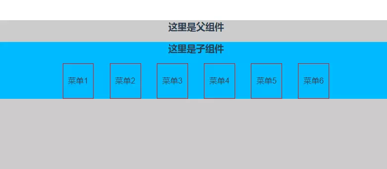
>具名插槽
* 父组件
```html
<template>
  <div class="father">
    <h3>这里是父组件</h3>
    <child>
      <div class="tmpl" slot="up">
        <span>菜单1</span>
        <span>菜单2</span>
        <span>菜单3</span>
        <span>菜单4</span>
        <span>菜单5</span>
        <span>菜单6</span>
      </div>
      <div class="tmpl" slot="down">
        <span>菜单-1</span>
        <span>菜单-2</span>
        <span>菜单-3</span>
        <span>菜单-4</span>
        <span>菜单-5</span>
        <span>菜单-6</span>
      </div>
      <div class="tmpl">
        <span>菜单->1</span>
        <span>菜单->2</span>
        <span>菜单->3</span>
        <span>菜单->4</span>
        <span>菜单->5</span>
        <span>菜单->6</span>
      </div>
    </child>
  </div>
</template>
```
* 子组件
```html
<template>
  <div class="child">
    // 具名插槽
    <slot name="up"></slot>
    <h3>这里是子组件</h3>
    // 具名插槽
    <slot name="down"></slot>
    // 匿名插槽
    <slot></slot>
  </div>
</template>
```
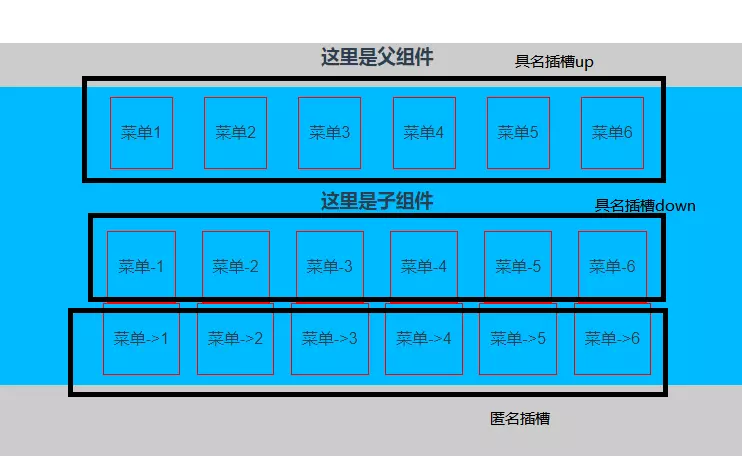
# (数据管理仓库)
* 1.命令行：
    cnpm i vuex -S
* 2.导入包
    main.js中输入：import Vuex from 'vuex'
* 3.注册vuex到vue中
    main.js中输入：Vue.use(Vuex)
* 4.new Vuex.Store()实例，得到一个数据仓储对象
```javaScript
var store = new Vuex.Store({
    state:{ // 通过this.$store.state.***来访问
        //相当于组件中的data,专门用来存储数据
        //如果在组件中想要访问store中的数据，通过this.$store.state.***来访问
    },
    mutations:{//this.$store.commit('方法名称','按需传递参数')
        //相当于组件中的methods
        方法名(state){//固定state参数，最多俩参数，若想传更多，可通过传对象

        }
    },   
    getters:{ // this.$store.getters.方法名
        //只负责对外提供数据，不负责修改数据，要想修改去mutations
        //跟过滤器很像，都是把元数据进行包装，提供给调用它的人
        //其次跟computed也很像，只要state中的数据发生变化并且getters正好也引用了这个数据，那么就会立即触发getters的重新求值
        //例子：
        optCount:function(state){
            return '我i想我今天也很快乐' + state.count
        }
    },
    action:{ // this.$store.dispatch("方法名"，参数)
        //负责提交mutation，而不是直接变更状态，
        //action可以包含任意异步操作
        //自动获得一个默认参数context,  它是一个store 实例，通过它可以获取到store 实例的属性和方法,如 context.state 就会获取到 state 属性， context.commit 就会执行commit命令。
        actions: {
            increment(context) {
                context.commit("INCREMENT");
            },
            decrement(context) {
                context.commit("DECREMENT");
            }
        }
    }
})
```
* 5.将vuex创建的store挂载到vm实例上
    const vm=new Vue({
        el:"#app",
        render:c=>c(App),
        store //挂载只要挂载到了vm中，任何组件都可以访问store中的数据
    })
>mapState方法：
* `...mapState(['nickName','cartCount'])` mapState是vuex封装的this.$store.state对象，加...解构
```javaScript
computed:{
    ...mapState(['nickName','cartCount']) // mapState是vuex封装的this.$store.state对象，加...解构
    /*
    nickName() { // 通过vuex实时获取用户名
      return this.$store.state.nickName
    },
    cartCount() {
      return this.$store.state.cartCount
    }
    */
  },
```
>补充es6
* 将数组中重复元素去掉：
```
a=[1,2,3,2,5]
[...new Set(a)] // [1,2,3,5]
```
