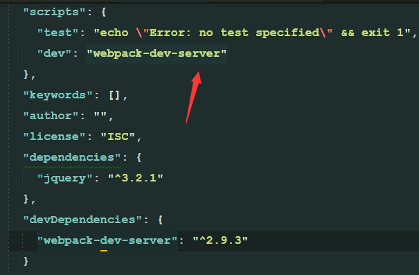
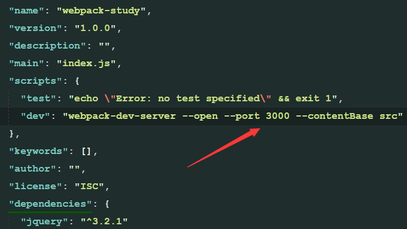
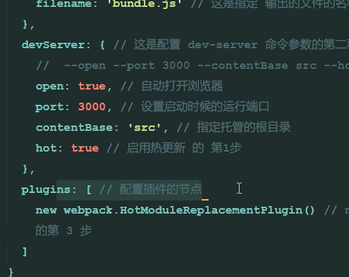
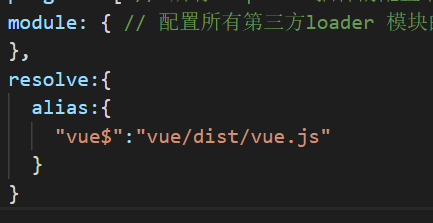

## 1.如果需要jq，首先本项目中打开命令行，输入
    npm i -y
> 此时你会发现你的项目栏多了一个package.json(我自己还发现有(package-lock.json)
## 2.正式安装jq,命令行输入
    npm i jquery -S
> 完成后你会发现项目栏中自动生成了一个node_modules文件夹
## 3.在index.html文件下编辑好内容，在main.js中写好jquery代码，然后在main.js中导入jquery包
> 因为我们已经在项目中安装了jq,所以可以直接在main.js导入代码：

    import $ from 'jquery'
> 之后即使你在index.html中添加链接导入main.js仍然实现不了jq效果，这是因为当前浏览器版本低，不支持import $ from 'jquery',于是引入webpack，此工具可以打包我们的css,js等扩展，使浏览器可以解析他们。
# webpack
## webpack安装
* `cnpm i webpack --save-dev` 
## webpack打包js文件（一般不用此方法）
*  `webpack hello.js(打包的文件) hello.bundle.js(打包到的文件)`
* 如果没有成功，改成命令：`webpack hello.js(打包的文件) --output hello.bundle.js(打包到的文件)`
* 每次更改代码都要重新输入上面的
## 在html文件中引入js文件
* `<script src="hello.bundle.js">`
## webpack打包在js中引入的css文件
* `cnpm i css-loader style-loader --save`
* `require('style-loader!css-loader!./hello.css')`
* 为了避免每次js文件引入css文件都需要`require('style-loader!css-loader!./hello.css')`：
    * `webpack hello.js hello.bundle.js --module-bind 'css=style-loader!css-loader' --watch`
    * js文件可以修改为`require(./hello.css)`了
## webpack打包sass文件
* `cnpm i sass-loader node-sass css-loader  style-loader --save`
## 避免每次更改代码都要执行webpack hello.js(打包的文件) hello.bundle.js(打包到的文件)
* 在项目根目录新建一个webpack.config.js文件。文件中输入代码：
```javaScript
const path = require('path')
module.exports = {  
    entry:path.join(__dirname,'./src/main.js'), // 入口文件
    output:{ // 出口文件
        path:path.join(__dirname,'./dist'),
        filename:'bundle.js'  // 打包到dist文件夹下的bundle.js里
    }
}

// 官网给的：
module.exports = {
  entry: './path/to/my/entry/file.js',
  output: {
    path: path.resolve(__dirname, 'dist'),
    filename: 'my-first-webpack.bundle.js'
  }
};
```
* 直接运行`webpack`代码就更改了
## 在未在一个js文件引入另一个js文件的情况下想将两个文件打包在一起
* webpack.config.js文件：
```javaScript
const path = require('path')
module.exports = {  
    entry:['./src/main.js','./src/a.js'] // 入口文件 
    output:{ // 出口文件
        path:path.join(__dirname,'./dist'),
        filename:'bundle.js'  // 打包到dist文件夹下的bundle.js里 
    }
}
```
## html文件取消导入js文件，直接webpack打包
* `cnpm i html-webpack-plugin -D`
* 同时在webpack-config.js中导入插件，代码：
```javaScript
    const htmlWebpackPlugin=require('html-webpack-plugin')
    plugins添加
    new htmlWebpackPlugin({
        template:path.jion(__dirname,'./src/index.html')
    })

// 官网
const HtmlWebpackPlugin = require('html-webpack-plugin'); //通过 npm 安装
const webpack = require('webpack'); //访问内置的插件
const path = require('path');

const config = {
  entry: './path/to/my/entry/file.js',
  output: {
    filename: 'my-first-webpack.bundle.js',
    path: path.resolve(__dirname, 'dist')
  },
  module: { // 一般用来存放解析不了的文件
    rules: [
      {
        test: /\.(js|jsx)$/,
        use: 'babel-loader'
      }
    ]
  },
  plugins: [ // 一般用存放插件
    new webpack.optimize.UglifyJsPlugin(),
    new HtmlWebpackPlugin({template: './src/index.html'}) // 这里的文件是自己建的index.html
  ]

//   如果想打包到指定文件下而不是系统给的文件下：
plugins: [
    new webpack.optimize.UglifyJsPlugin(),
    new HtmlWebpackPlugin({
        filename: 'index-[hash].html' // 打包到dist文件夹下的index-[hash].html
        template: './src/index.html' // 这里的文件是自己建的index.html，要打包的就是这货
    }) 
  ]
// 如果想传递给index-[hash].html文件一些东西：
plugins: [
    new webpack.optimize.UglifyJsPlugin(),
    new HtmlWebpackPlugin({
        filename: 'index-[hash].html' // 打包到dist文件夹下的index-[hash].html
        template: './src/index.html' // 这里的文件是自己建的index.html，要打包的就是这货
        inject: 'head',
        title: 'webpack is good',
        date: new Date()
    }) 
  ]
// ./src/index.html
<title><%= htmlWebpackPlugin.options.date%></title> // <%= htmlWebpackPlugin.options.参数%>
};

module.exports = config;
```
## 安装vue文件和解析es6的文件
* ` cnpm i --save vue-loader vue-template-compiler babel-preset-env babel-core`
* 新建文件.babelrc文件
    {
        "presets": ["env"]
    }
* webpack.config.js
```javaScript
const VueLoaderPlugin = require('vue-loader/lib/plugin');
var path = require('path')
module.exports = {
  entry: './src/lib/index.js',  // 入口文件
  output: {
    path: path.join(__dirname,'./dist'),
    filename: 'vue-toast-demo.js' // 打包出来的wenjian
  },
  module: {
    rules:[
      {
        test:/\.vue$/,
        loader:'vue-loader'
      }
    ]
  },
  plugins: [
      // make sure to include the plugin for the magic
    new VueLoaderPlugin()
  ]
}
```


## 4. 创建webpack，将引入外部扩展文件的那个js文件通过webpack放在bundle.js(自己起的名字)里，命令行输入：
    webpack .\src\main.js .\dist\bundle.js

* 完成之后你会发现dist文件夹下生成了一个bundle.js文件。这里的.\src\main.js文件是专门用来导入各个文件包的。这个命令的目的是将main.js处理好并放入dist目录下bundle.js。成功：

* 如果没有成功，改成命令：
    webpack .\src\main.js --output .\dist\bundle.js
* 前提是在index.html中导入bundle.js
`<script src="../dist/bundle.js">`
## 5.但是如果修改我们的html内容，我们还需要再次使用第4步骤中的命令行，太麻烦，于是在项目根目录新建一个webpack.config.js文件。文件中输入代码：
```
const path = require('path')
module.exports = {  
    entry:path.join(__dirname,'./src/main.js'),
    output:{
        path:path.join(__dirname,'./dist'),
        filename:'bundle.js'
    }
}
```
## 7.命令行输入
    webpack
> 之后再更改html则会自动更改样式，但我们每次更改后都要输入webpack，于是有了方法8
## 8.为了让更改后的样式自动更新，命令行输入
    cnpm i webpack-dev-server -D
## 9.将webpack-dev-server命令安装到本地，方法：在package.json中的scripts对象中输入
    "dev":"webpack-dev-server --open --port 3000 --contentBase src --hot"
## 10.运行更改，在命令行输入
    npm run dev



## 11.安装webpack,在命令行输入
    cnpm i webpack -D
## 12.运行更改，在命令行输入
    npm run dev
> 可发现网页可以自动变换更改了，前提是把你的index.html中引入的script变成`<script src="/bundle.js">`
## 扩展：9方法中的 --open --port 3000 --contentBase src --hot可以写在webpack.config.js里，如图，并在webpack.config,js里添加
    const webpack = require('webpack')


* 麻烦，因此推荐使用方法9
## 13.在内存中生成html,下载插件，命令行输入
    cnpm i html-webpack-plugin -D
## 14.同时在webpack-dev-server中导入插件，代码：
    const htmlWebpackPlugin=require('html-webpack-plugin')
    plugins添加
    new htmlWebpackPlugin({
        template:path.jion(__dirname,'./src/index.html')
    })

* 这之后可以不再在index.html中引用bundle.js了
## 15.引入css文件。在css文件夹建立index.css文件，然后在main.js导入样式表
    import './css/index.css'
## 16.命令行输入
    cnpm i style-loader css-loader -D
## 17.同时打开webpack.config.js,添加代码：

* 启用npm run dev
## 18.引入less文件。在css文件夹建立index.less文件，然后在main.js导入样式表
    import './css/index.less'
## 19.命令行输入
    cnpm i less-loader -D
    之后输入
    cnpm i less -D
## 20.同时打开webpack.config.js,添加代码：

* 启用npm run dev
## 21.引入less文件。在css文件夹建立index.scss文件，然后在main.js导入样式表
    import './css/index.scss'
## 22.命令行输入
    cnpm i sass-loader -D
    之后输入
    cnpm i node-sass -D
## 23.同时打开webpack.config.js,添加代码：

* 启用npm run dev
# webpack 安装vue项目
## 1.npm i vue -S
## 2.导入vue文件
* 方法1.
    * main.js导入：import Vue from 'vue'
    * 更改webpack.config.js
    
* 方法2
    * main.js导入：import Vue from '../node_modules/vue/dist/vue.js'
* 方法3
    * main.js导入：import Vue from 'vue'
    * 找到node_modules/vue/config.js,找到main方法，更改路径为vue.js
## 3.导入组件
### 如果main.js导入：import Vue from 'vue'，且没有其他任何文件的更改，要想导入.vue文件方法：
* 命令行：cnpm i vue-loader vue-template-compiler -D
* 在main.js中导入vue模块：import Vue from 'vue'
* 定义一个.vue结尾的组件，其中组件有三部分组成：template script style
* 在main.js使用import login from './login.vue'倒入这个组件
* 创建vm的实例var vm=new Vue({el:'#app',render:c=>c(login)})
* 在页面中创建一个id为app的div元素，作为vm实例要控制的区域
# 扩展
## 生成node_modules文件方法：命令行
    npm install
# webpack 移除严格模式
* 1.命令行
    cnpm install babel-plugin-transform-remove-strict-mode -D
* 2.babelrc文件新增 "transform-remove-strict-mode" 语句
```
{
  "presets": ["env", "stage-0"],
  "plugins": ["transform-runtime", ["component", [
    {
      "libraryName": "mint-ui",
      "style": true
    }
  ]], "transform-remove-strict-mode"]
}
```
# 安装图片预览插件
* main.js:
    import VuePreview from 'vue-preview'
    Vue.use(VuePreview)
# vue-cli----------安装stylus-loader
(https://www.jianshu.com/p/c02f5f94b77e)
    1.命令行:cnpm install stylus -D
    2.npm install stylus-loader css-loader style-loader --save-dev
    3.<style lang="stylus"><style>
* 我的妈妈这又坑了我这个笨孩子！
    * vs code编辑器在我写stylu样式一直报错，我一直以为是我没安装好，其实要滚去安装高亮插件以及设置
        "files.associations": {
            ".vue":"html",
            ".vue": "vue"
        },
* 据百度说不用给webpack.base.conf.js设置什么text，但是我设置了也没错，所以下个项目试试不设置会不会也ok！因为我不想在这个项目乱动手脚了
# 手机端查看项目
* 1.在确保手机和电脑处于同一个wifi,然后把浏览器链接改成： 电脑ip:8080/#!/goods
* 打开草料官网，把浏览器地址生成二维码，手机扫描ok